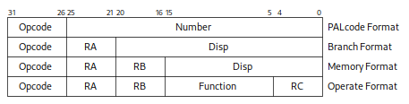

# Chapter 1 · Introduction

Alpha is a 64-bit load/store RISC architecture that is designed with
particular emphasis on the three elements that most affect performance: clock
speed, multiple instruction issue, and multiple processors.

The Alpha architects examined and analyzed current and theoretical RISC
architecture design elements and developed high-performance alternatives for
the Alpha architecture. The architects adopted only those design elements
that appeared valuable for a projected 25-year design horizon. Thus, Alpha
becomes the first 21st century computer architecture.

The Alpha architecture is designed to avoid bias toward any particular
operating system or programming language. Alpha initially supports the VAX
VMS and OSF/1 (UNIX) operating systems, and supports simple software
migration from applications that run on those operating systems.

This handbook describes in detail how Alpha is designed to be the leadership
64-bit architecture of the computer industry.

## The Alpha Approach to RISC Architecture

### Alpha Is a True 64-Bit Architecture

Alpha was designed as a 64-bit architecture. All registers are 64 bits in
length and all operations are performed between 64-bit registers. It is not a
32-bit architecture that was later expanded to 64 bits.

### Alpha Is Designed for Very High-Speed Implementations

The instructions are very simple. All instructions are 32 bits in length.
Memory operations are either loads or stores. All data manipulation is done
between registers.

The Alpha architecture facilitates pipelining multiple instances of the same
operations because there are no special registers and no condition codes.

The instructions interact with each other only by one instruction writing a
register or memory and another instruction reading from the same place. That
makes it particularly easy to build implementations that issue multiple
instructions every CPU cycle. (The first implementation issues two
instructions per cycle.)

Alpha makes it easy to maintain binary compatibility across multiple
implementations and easy to maintain full speed on multiple-issue
implementations. For example, there are no implementation-specific pipeline
timing hazards, no load-delay slots, and no branch-delay slots.

### Alpha's Approach to Byte Manipulation

The Alpha architecture does byte shifting and masking with normal 64-bit
register-to-register instructions, crafted to keep instruction sequences
short.

Alpha does not include single-byte store instructions. This has several
advantages:

- Cache and memory implementations need not include byte shift-and-mask
  logic, and sequencer logic need not perform read-modify-write on memory
  locations. Such logic is awkward for high-speed implementation and tends to
  slow down cache access to normal 32-bit or 64-bit aligned quantities.

- Alpha's approach to byte manipulation makes it easier to build a high-speed
  error-correcting write-back cache, which is often needed to keep a very
  fast RISC implementation busy.

- Alpha's approach can make it easier to pipeline multiple byte operations.

### Alpha's Approach to Arithmetic Traps

Alpha lets the software implementor determine the precision of arithmetic
traps. With the Alpha architecture, arithmetic traps (such as overflow and
underflow) are imprecise — they can be delivered an arbitrary number of
instructions after the instruction that triggered the trap. Also, traps from
many different instructions can be reported at once. That makes
implementations that use pipelining and multiple issue substantially easier
to build.

However, if precise arithmetic exceptions are desired, trap barrier
instructions can be explicitly inserted in the program to force traps to be
delivered at specific points.

### Alpha's Approach to Multiprocessor Shared Memory

As viewed from a second processor (including an I/O device), a sequence of
reads and writes issued by one processor may be arbitrarily reordered by an
implementation. This allows implementations to use multibank caches, bypassed
write buffers, write merging, pipelined writes with retry on error, and so
forth. If strict ordering between two accesses must be maintained, explicit
memory barrier instructions can be inserted in the program.

The basic multiprocessor interlocking primitive is a RISC-style load_locked,
modify, store_conditional sequence. If the sequence runs without interrupt,
exception, an interfering write from another processor, or a CALL_PAL
instruction, then the conditional store succeeds. Otherwise, the store fails
and the program eventually must branch back and retry the sequence. This
style of interlocking scales well with very fast caches, and makes Alpha an
especially attractive architecture for building multiple-processor systems.

### Alpha Instructions Include Hints for Achieving Higher Speed

A number of Alpha instructions include hints for implementations, all aimed
at achieving higher speed.

- Calculated jump instructions have a target hint that can allow much faster
  subroutine calls and returns.

- There are prefetching hints for the memory system that can allow much
  higher cache hit rates.

- There are granularity hints for the virtual-address mapping that can allow
  much more effective use of translation lookaside buffers for large
  contiguous structures.

### PALcode — Alpha's Very Flexible Privileged Software Library

A Privileged Architecture Library (PALcode) is a set of subroutines that are
specific to a particular Alpha operating system implementation. These
subroutines provide operating-system primitives for context switching,
interrupts, exceptions, and memory management. PALcode is similar to the BIOS
libraries that are provided in personal computers.

PALcode subroutines are invoked by implementation hardware or by software
CALL_PAL instructions.

PALcode is written in standard machine code with some implementation-specific
extensions to provide access to low-level hardware.

One version of PALcode lets Alpha implementations run the full VMS operating
system by mirroring many of the VAX VMS features. The VMS PALcode
instructions let Alpha run VMS with little more hardware than that found on a
conventional RISC machine: the PAL mode bit itself, plus 4 extra protection
bits in each Translation Buffer entry.

Another version of PALcode lets Alpha implementations run the OSF/1 operating
system by mirroring many of the RISC ULTRIX features. Other versions of
PALcode can be developed for real-time, teaching, and other applications.

PALcode makes Alpha an especially attractive architecture for multiple
operating systems.

### Alpha and Programming Languages

Alpha is an attractive architecture for compiling a large variety of
programming languages. Alpha has been carefully designed to avoid bias toward
one or two programming languages. For example:

- Alpha does not contain a subroutine call instruction that moves a register
  window by a fixed amount. Thus, Alpha is a good match for programming
  languages with many parameters and programming languages with no
  parameters.

- Alpha does not contain a global integer overflow enable bit. Such a bit
  would need to be changed at every subroutine boundary when a FORTRAN
  program calls a C program.

## Data Format Overview

Alpha is a load/store RISC architecture with the following data
characteristics:

- All operations are done between 64-bit registers.
- Memory is accessed via 64-bit virtual little-endian byte addresses.
- There are 32 integer registers and 32 floating-point registers.
- Longword (32-bit) and quadword (64-bit) integers are supported.
- Four floating-point data types are supported:
  - VAX F_floating (32-bit)
  - VAX G_floating (64-bit)
  - IEEE single (32-bit)
  - IEEE double (64-bit)

## Instruction Format Overview

As shown in Figure 1-1, Alpha instructions are all 32 bits in length. As
represented in Figure 1-1, there are four major instruction format classes
that contain 0, 1, 2, or 3 register fields. All formats have a 6-bit opcode.

_Figure 1-1 • Instruction Format Overview_

- **PALcode instructions** specify, in the function code field, one of a few
  dozen complex operations to be performed.

- **Conditional branch instructions** test register Ra and specify a signed
  21-bit PC-relative longword target displacement. Subroutine calls put the
  return address in register Ra.

- **Load and store instructions** move longwords or quadwords between
  register Ra and memory, using Ra plus a signed 16-bit displacement as the
  memory address.

- **Operate instructions** for floating-point and integer operations are both
  represented in Figure 1-1 by the operate format illustration and are as
  follows:

  - Floating-point operations use Ra and Rb as source registers, and write
    the result in register Rc. There is an 11-bit extended opcode in the
    function field.

  - Integer operations use Ra and Rb or an 8-bit literal as the source
    operand, and write the result in register Rc.

    Integer operate instructions can use the Rb field and part of the
    function field to specify an 8-bit literal. There is a 7-bit extended
    opcode in the function field.

## Instruction Overview

### PALcode Instructions

As described above, a Privileged Architecture Library (PALcode) is a set of
subroutines that is specific to a particular Alpha operating-system
implementation. These subroutines can be invoked by hardware or by software
CALL_PAL instructions, which use the function field to vector to the
specified subroutine.

### Branch Instructions

Conditional branch instructions can test a register for positive/negative or
for zero/nonzero. They can also test integer registers for even/odd.

Unconditional branch instructions can write a return address into a register.

There is also a calculated jump instruction that branches to an arbitrary
64-bit address in a register.

### Load/Store Instructions

Load and store instructions move either 32-bit or 64-bit aligned quantities
from and to memory. Memory addresses are flat 64-bit virtual addresses, with
no segmentation.

The VAX floating-point load/store instructions swap words to give a
consistent register format for floating-point operations.

A 32-bit integer datum is placed in a register in a canonical form that makes
33 copies of the high bit of the datum. A 32-bit floating-point datum is
placed in a register in a canonical form that extends the exponent by 3 bits
and extends the fraction with 29 low-order zeros. The 32-bit operates
preserve these canonical forms.

There are facilities for doing byte manipulation in registers, eliminating
the need for 8-bit or 16-bit load/store instructions.

Compilers, as directed by user declarations, can generate any mixture of
32-bit and 64-bit operations. The Alpha architecture has no 32/64 mode bit.

### Integer Operate Instructions

The integer operate instructions manipulate full 64-bit values, and include
the usual assortment of arithmetic, compare, logical, and shift instructions.

There are just three 32-bit integer operates: add, subtract, and multiply.
They differ from their 64-bit counterparts only in overflow detection and in
producing 32-bit canonical results.

There is no integer divide instruction.

The Alpha architecture also supports the following additional operations:

- Scaled add/subtract instructions for quick subscript calculation
- 128-bit multiply for division by a constant, and multiprecision arithmetic
- Conditional move instructions for avoiding branch instructions
- An extensive set of in-register byte and word manipulation instructions

Integer overflow trap enable is encoded in the function field of each
instruction, rather than kept in a global state bit. Thus, for example, both
ADDQ/V and ADDQ opcodes exist for specifying 64-bit ADD with and without
overflow checking. That makes it easier to pipeline implementations.

### Floating-Point Operate Instructions

The floating-point operate instructions include four complete sets of VAX and
IEEE arithmetic instructions, plus instructions for performing conversions
between floating-point and integer quantities.

In addition to the operations found in conventional RISC architectures, Alpha
includes conditional move instructions for avoiding branches and merge
sign/exponent instructions for simple field manipulation.

The arithmetic trap enables and rounding mode are encoded in the function
field of each instruction, rather then kept in global state bits. That makes
it easier to pipeline implementations.

## Instruction Set Characteristics

Alpha instruction set characteristics are as follows:

- All instructions are 32 bits long and have a regular format.

- There are 32 integer registers (R0 through R31), each 64 bits wide. R31
  reads as zero, and writes to R31 are ignored.

- There are 32 floating-point registers (F0 through F31), each 64 bits wide.
  F31 reads as zero, and writes to F31 are ignored.

- All integer data manipulation is between integer registers, with up to two
  variable register source operands (one may be an 8-bit literal), and one
  register destination operand.

- All floating-point data manipulation is between floating-point registers,
  with up to two register source operands and one register destination
  operand.

- All memory reference instructions are of the load/store type that move data
  between registers and memory.

- There are no branch condition codes. Branch instructions test an integer or
  floating-point register value, which may be the result of a previous
  compare.

- Integer and logical instructions operate on quadwords.

- Floating-point instructions operate on G_floating, F_floating, IEEE double,
  and IEEE single operands. D_floating “format compatibility,” in which
  binary files of D_floating numbers may be processed, but without the last 3
  bits of fraction precision, is also provided.

- A minimal number of VAX compatibility instructions are included.

## Terminology and Conventions

The following sections describe the terminology and conventions used in this
book.

### Numbering

All numbers are decimal unless otherwise indicated. Where there is ambiguity,
numbers other than decimal are indicated with the name of the base in
subscript form, for example, 1016.

### Security Holes

A security hole is an error of commission, omission, or oversight in a system
that allows protection mechanisms to be bypassed.

Security holes exist when unprivileged software (that is, software running
outside of kernel mode) can:

- Affect the operation of another process without authorization from the
  operating system;

- Amplify its privilege without authorization from the operating system; or

- Communicate with another process, either overtly or covertly, without
  authorization from the operating system.

The Alpha architecture has been designed to contain no architectural security
holes. Hardware (processors, buses, controllers, and so on) and software
should likewise be designed to avoid security holes.

### UNPREDICTABLE and UNDEFINED

In this book, the terms UNPREDICTABLE and UNDEFINED are used. Their meanings
are quite different and must be carefully distinguished. One key difference
is that only privileged software (that is, software running in kernel mode)
may trigger UNDEFINED operations, whereas either privileged or unprivileged
software may trigger UNPREDICTABLE results or occurrences. A second key
difference is that UNPREDICTABLE results and occurrences do not disrupt the
basic operation of the processor; the processor continues to execute
instructions in its normal manner. In contrast, UNDEFINED operation may halt
the processor or cause it to lose information.

A result specified as UNPREDICTABLE may acquire an arbitrary value subject to
a few constraints. Such a result may be an arbitrary function of the input
operands or of any state information that is accessible to the process in its
current access mode. UNPREDICTABLE results may be unchanged from their
previous values. Operations that produce UNPREDICTABLE results may also
produce exceptions.

UNPREDICTABLE results must not be security holes.

Specifically, UNPREDICTABLE results must not:

- Depend upon, or be a function of, the contents of memory locations or
  registers that are inaccessible to the current process in the current
  access mode.

Also, operations that may produce UNPREDICTABLE results must not:

- Write or modify the contents of memory locations or registers to which the
  current process in the current access mode does not have access, or

- Halt or hang the system or any of its components.

For example, a security hole would exist if some UNPREDICTABLE result
depended on the value of a register in another process, on the contents of
processor temporary registers left behind by some previously running process,
or on a sequence of actions of different processes.

An occurrence specified as UNPREDICTABLE may happen or not based on an
arbitrary choice function. The choice function is subject to the same
constraints as are UNPREDICTABLE results and, in particular, must not
constitute a security hole.

Results or occurrences specified as UNPREDICTABLE may vary from moment to
moment, implementation to implementation, and instruction to instruction
within implementations. Software can never depend on results specified as
UNPREDICTABLE.

Operations specified as UNDEFINED may vary from moment to moment,
implementation to implementation, and instruction to instruction within
implementations. The operation may vary in effect from nothing, to stopping
system operation. UNDEFINED operations must not cause the processor to hang,
that is, reach an unhalted state from which there is no transition to a
normal state in which the machine executes instructions. Only privileged
software (that is, software running in kernel mode) may trigger UNDEFINED
operations.

### Ranges and Extents

Ranges are specified by a pair of numbers separated by a “..” and are
inclusive. For example, a range of integers 0..4 includes the integers 0, 1,
2, 3, and 4.

Extents are specified by a pair of numbers in angle brackets separated by a
colon and are inclusive. For example, bits <7:3> specify an extent of bits
including bits 7, 6, 5, 4, and 3.

### ALIGNED and UNALIGNED

In this document the terms ALIGNED and NATURALLY ALIGNED are used
interchangeably to refer to data objects that are powers of two in size. An
aligned datum of size 2N is stored in memory at a byte address
that is a multiple of 2N, that is, one that has N low-order zeros.
Thus, an aligned 64-byte stack frame has a memory address that is a multiple
of 64.

If a datum of size 2N is stored at a byte address that is not a
multiple of 2N, it is called UNALIGNED.

### Must Be Zero (MBZ)

Fields specified as Must be Zero (MBZ) must never be filled by software with
a non-zero value. These fields may be used at some future time. If the
processor encounters a non-zero value in a field specified as MBZ, an Illegal
Operand exception occurs.

### Read As Zero (RAZ)

Fields specified as Read as Zero (RAZ) return a zero when read.

### Should Be Zero (SBZ)

Fields specified as Should be Zero (SBZ) should be filled by software with a
zero value. Non-zero values in SBZ fields produce UNPREDICTABLE results and
may produce extraneous instruction-issue delays.

### Ignore (IGN)

Fields specified as Ignore (IGN) are ignored when written.

### Implementation Dependent (IMP)

Fields specified as Implementation Dependent (IMP) may be used for
implementation-specific purposes. Each implementation must document fully the
behavior of all fields marked as IMP by the Alpha specification.

### Figure Drawing Conventions

Figures that depict registers or memory follow the convention that increasing
addresses run right to left and top to bottom.

### Macro Code Example Conventions

All instructions in macro code examples are either listed in Chapter 4 or are
stylized code forms found in Appendix A.

