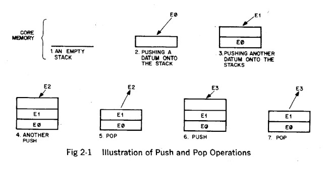
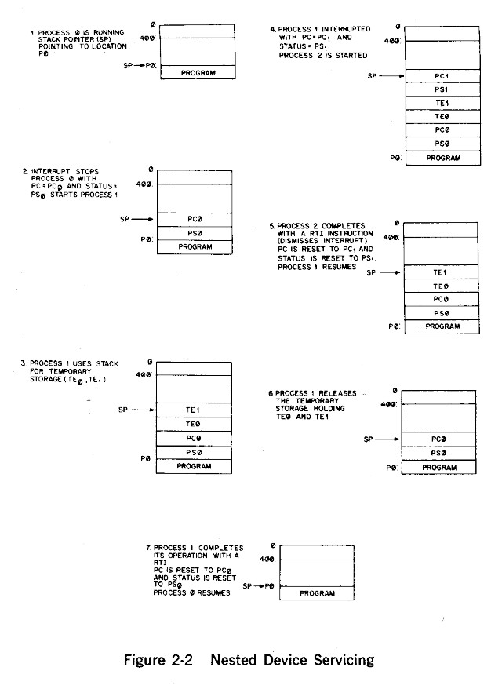

# Chapter 2. System Introduction

## System Definition

Digital Equipment Corporation’s PDP-11 is a 16-bit, general-purpose,
parallel-logic computer using two’s complement arithmetic. The PDP-11 is a
variable word length processor which directly addresses 32,768 16-bit words
or 65,536 8-bit bytes. All communication between system components is done on
a single high-speed bus called a Unibus. Standard features of the system
include eight general-purpose registers which can be used as accumulators,
index registers, or address pointers, and a multi-level automatic priority
interrupt system.

## System Components

### Unibus

There are five concepts that are very important for understanding both the
hardware and software implications of the Unibus.

#### Single Bus

The Unibus is a single, common path that connects the central processor,
memory, and all peripherals. Addresses, data, and control information are
sent along the 56 lines of the bus.

The form of communication is the same for every device on the Unibus. The
processor uses the same set of signals to communicate with memory as with
peripheral devices. Peripheral devices also use this set of signals when
communicating with the processor, memory, or other peripheral devices.

Peripheral device registers may be manipulated as flexibly as core memory by
the central processor. All the instructions that can be applied to data in
core memory can be applied equally well to data in peripheral device
registers. This is an especially powerful feature, considering the special
capability of PDP-11 instructions to process data in any memory location as
though it were an accumulator.

#### Bidirectional Lines

Unibus lines are bidirectional, so that the same signals which are received
as input can be driven as output. This means that a peripheral device
register can be either read or set by the central processor or other
peripheral devices; thus, the same register can be used for both input and
output functions.

#### Master-Slave Relation

Communication between two devices on the bus is in the form of a master-slave
relationship. At any point in time, there is one device that has control of
the bus. This controlling device is termed the “bus master.” The master
device controls the bus when communicating with another device on the bus,
termed the “slave.” A typical example of this relationship is the processor,
as master, fetching an instruction from memory (which is always a slave).
Another example is the disk, as master, transferring data to memory, as
slave.

#### Interlocked Communication

Communication on the Unibus is interlocked so that for each control signal
issued by the master device, there must be a response from the slave in order
to complete the transfer. Therefore, communication is independent of the
physical bus length and the response time of the master and slave devices.
The maximum transfer rate on the Unibus is one 16-bit word every 750
nanoseconds, or 1.3 million 16-bit words per second.

#### Dynamic Master-Slave Relation

Master-slave relationships are dynamic. The processor, for example, may pass
bus control to a disk. The disk, as master, could then communicate with a
slave memory bank.

Since the Unibus is used by the processor and all I/O devices, there is a
priority structure to determine which device gets control of the bus.
Therefore, every device on the Unibus which is capable of becoming bus master
has a priority assigned to it. When two devices which are capable of becoming
a bus master request use of the bus simultaneously, the device with the
higher priority will receive control first. Details of what conditions must
be satisfied before a device will get control of the bus are given in the
section on System Interaction.

### KA11 Central Processor

There are four major features which are of particular interest to the
programmer:

1. the General Registers;
2. the Processor Status Word;
3. the Addressing Modes; and
4. the Instruction Set.

The addressing modes and the instruction set of the PDP-11 processor will be
discussed in detail in Chapters 3 and 4.

#### General Registers

The KA11 processor contains eight 16-bit general registers. These eight
general registers (referred to as R0, R1, . . . . . R7) may be used as
accumulators, as index registers, or as stack pointers. One of these
registers, R7, is reserved as a program counter (PC). Generally, the PC holds
the address of the next instruction, but it may point to data or to an
address of data. The register R6 has the special function of processor stack
pointer.

#### Central Processor Status Register

The Central Processor Status Register (PS) contains information on the
current priority of the processor, the result of previous operations, and an
indicator for detecting the execution of an instruction to be trapped during
program debugging. The priority of the central processor can be set under
program control to any one of eight levels. This information is held in bits
5, 6, and 7 of the PS.

Four bits of the PS are assigned to monitoring different results of previous
instructions. These bits are set as follows:

* N — if the result was negative;
* Z — if the result was zero;
* V — if the operation resulted in an arithmetic overflow;
* C — if the operation resulted in a carry from the most significant bit.

The T bit is used in program debugging and can be set or cleared under
program control. If this bit is set, when an instruction is fetched from
memory, a processor trap will be caused by the completion of the
instruction’s execution.

")

### Core Memory

The PDP-11 allows both 16-bit word and 8-bit byte addressing. The address
space may be filled by core memory and peripheral device registers. The top
4,096 words generally are reserved for peripheral device registers. The
remainder of address space can be used for read-write core memory or
read-only core memory.

Read-write core memory is currently available in 4,096 16-bit word segments.
This memory has a cycle time of 1.2 microseconds and an access time of 500
nanoseconds. It is a standard part of a PDP-11/20 system.

Read-only core memory (ROM) is available in 1,024 16 bit-word segments. The
access time of the ROM is 500 nanoseconds. Memory is also available in 128
16-bit word segments with a 2.0 microsecond cycle time. Both 1,024 words of
read-only memory and 128 words of read-write memory mount in a single System
Unit and are a standard part of the PDP-11/10 system.

### Peripheral Devices

The ASR-33 Teletype with low-speed paper tape reader and punch is provided in
the basic PDP-11/20 system. Options for the PDP-11 include a paper tape
reader capable of reading 300 characters per second, a paper tape punch with
an output capacity of 50 characters per second, and additional Teletype
units. Provision is made for the addition of numerous peripheral devices.
These include standard DEC peripherals as well as other devices which will be
unique to the PDP-11.

## System Interaction

At any point in time only one device can be in control of the bus, or be bus
master. The master communicates with another device on the bus which is
called the slave. Usually, the established master will communicate with the
slave in the form of data transfers.

Full 16-bit words or 8-bit bytes of information can be transferred on the bus
between the master and the slave. The information can be instructions,
addresses, or data. This type of operation occurs when the processor, as
master, is fetching instructions, operands, and data from memory, and
restoring the results into memory after execution of instructions. Pure data
transfers occur between a disk control and memory.

### Transfer of Bus Master

When a device (other than the central processor) is capable of becoming bus
master and requests use of the bus, it is generally for one of two purposes:

1. to make a non-processor transfer of data directly to or from memory, or
2. to interrupt program execution and force the processor to branch to a
   specific address where an interrupt service routine is located.

### Priority Structure

When a device capable of becoming bus master requests use of the bus, the
handling of that request depends on the location of that device in the
priority structure. These factors must be considered to determine the
priority of the request:

1. The processor’s priority can be set under program control to one of eight
   levels using bits 7, 6, and 5 in the processor status register. These
   three bits set a priority level that inhibits granting of bus requests on
   lower levels.

2. Bus requests from external devices can be made on one of five request
   lines. A non-processor request (NPR) has the highest priority, and its
   request is honored by the processor between bus cycles of an instruction
   execution. Bus request 7 (BR7) is the next highest priority, and BR4 is
   the lowest. The four lower level priority requests are honored by the
   processor between instructions. When the processor’s priority is set to a
   level, for example 6, all bus requests on BR6 and below are ignored.

3. When more than one device is connected to the same bus request (BR) line,
   a device nearer the central processor has a higher priority than a device
   farther away. Any number of devices can be connected to a given BR or NPR
   line.

Once a device other than the processor has control of the bus, it is for one
of two types of requests: 1) NPR Request, 2) Interrupt Request.

### NPR Requests

NPR data transfers can be made between any two peripheral devices without the
supervision of the processor. Normally, NPR transfers are between a mass
storage device, such as a disk, and core memory. The structure of the bus
also permits device-to-device transfers, allowing customer-designed
peripheral controllers to access other devices such as disks directly.

An NPR device has very fast access to the bus and can transfer at high data
rates once it has control. The processor state is not affected by the
transfer; therefore the processor can relinquish control while an instruction
is in progress. This can occur at the end of any bus cycle except in between
a read-modify-write sequence. (See Chapter 8 for details). In the PDP-11, an
NPR device can gain bus control in 3.5 microseconds or less. An NPR device in
control of the bus may transfer 16-bit words from memory at memory speed or
every 1.2 microseconds in the PDP-11/20 or every 1.0 microseconds in the
PDP-11/10.

### Interrupt Requests

Devices that request interrupts on the bus request lines (BR7, BR6, BR5, BR4)
can take advantage of the power and flexibility of the processor. The entire
instruction set is available for manipulating data and status registers. When
a device servicing program must be run, the task currently under way in the
central processor is interrupted and the device service routine is initiated.
Once the device request has been satisfied, the processor returns to the
interrupted task.

In the PDP-11, the return address for the interrupted routine and the
processor status word are held in a “stack.” A stack is a dynamic sequential
list of data with special provision for access from one end. A stack is also
called a “push down” or “LIFO” (Last-In First-Out) list. Storage and
retrieval from stacks is called “pushing” and “popping” respectively. These
operations are illustrated in Figure 2-1.

In the PDP-11, a stack is automatically maintained by the hardware for
interrupt processing. Thus, higher level requests can interrupt the
processing of lower level interrupt service, and automatically return control
to the lower level interrupt service routines when the higher level servicing
is completed.

Here is an example of this procedure. A peripheral requires service and
requests use of the bus at one of the BR levels (BR7, BR6, BR5, BR4). The
operations undertaken to “service” the device are as follows:

1. Priorities permitting, the processor relinquishes the bus to that device.

2. When the device has control of the bus, it sends the processor an
   interrupt command with the address of the words in memory containing the
   address and status of the appropriate device service routine.

3. The processor then “pushes” — first, the current central processor status
   (PS) and then, the current program counter (PC) onto the processor stack.

4. The new PC and PS (the “interrupt vector”) are taken from the location
   specified by the device and the next location, and the device service
   routine is begun. Note that those operations all occur automatically and
   that no device-polling is required to determine which service routine to
   execute.

5. 7.2 microseconds is the time interval between the central processor’s
   receiving the interrupt command and the fetching of the first instruction.
   This assumes there were no NPR transfers during this time.

6. The device service routine can resume the interrupted process by executing
   the RTI (ReTurn from Interrupt) instruction which “pops” the processor
   stack back into the PC and PS. This requires 4.5 microseconds if there are
   no intervening NPR’s.

7. A device service routine can be interrupted in turn by a sufficiently high
   priority bus request any time after completion of its first instruction.

8. If such an interrupt occurs, the PC and PS of the device service routine
   are automatically pushed into the stack and the new device routine
   initiated as above. This “nesting” of priority interrupts can go on to any
   level, limited only by the core available for the stack. More commonly,
   this process will nest only four levels deep since there are four levels
   of BR signals. An example of nested device servicing is shown in Figure
   2-2. A rough core map is given for each step of the process. The SP points
   to the top word of the stack as shown.

