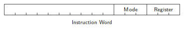
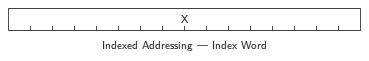
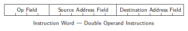

# Chapter 3. Addressing Modes

Most data in a program is structured in some way — in a table, in a stack, in
a table of addresses, or perhaps in a small set of frequently-used variables
local to a limited region of a program. The PDP-11 handles these common data
structures with addressing modes specifically designed for each kind of
access. In addition, addressing for unstructured data is general enough to
permit direct random access to all of core. Memory is not broken up into
pages and fields (often awkward and wasteful of core storage).

Addressing in the PDP-11 is done through the general registers. Programs
requiring several stacks can use the general registers for stack pointers.
Those requiring many local variables can use general registers as
accumulators. The general registers can be used interchangeably as index
registers or as sequential list pointers to access tabular data. Address
arithmetic may be done directly in the general registers.

## Address Fields

PDP-11 instruction words contain a 6-bit address field divided into two
subfields selecting the general register and the mode generating the
effective address.

The register subfield specifies which of the eight general registers is to be
used in the address calculation. The mode subfield indicates how this
register is to be used in determining the operand. These modes will be
described in the following paragraphs.

### General Register Addressing

The general registers will be used as simple accumulators for operating on
frequently-accessed variables. In this mode, the operand is held directly in
the general register. The general registers are in fast memory
(280-nanosecond cycle time), resulting in a speed improvement for operations
on these variables.

PAL-11, the PDP-11 assembler, interprets instructions of the form

    OPR  R

as general register operations. R has been defined as a register name and OPR
is used to represent a general instruction mnemonic. The address field for
general register operations is

Operands that are pointed to by addresses (indirect or deferred) are denoted
to PAL-11 by the @ symbol. Thus, instructions of the form

    OPR  @R

specify deferred register addressing and have the following address field.

Deferred register addressing may also be selected in PAL-11 by the form OPR
(R).

### Indexed Addressing

The general registers may be used as index registers to permit random access
of items in tables or stacks of data. Instructions of the form

    OPR  X(R)

specify indexed mode addressing. The effective address is the sum of X and
the contents of the specified general register R.

The index word containing X follows the instruction word.

Index mode addressing can be deferred to permit access of data elements
through tables or stacks of their addresses. The address field for index
deferred mode is

It is specified by instructions of the form

    OPR  @X(R)

### Autoincrement Addressing

Autoincrement addressing provides for automatic stepping of a pointer through
sequential elements of a table of operands. In this mode, the address of the
operand is taken from the general register and then the contents of the
register are stepped (incremented by one or two) to address the next word or
byte depending upon whether the instruction operates on byte or word data.
Instructions of the form

    OPR  (R)+

specify autoincrement addressing. The address field for autoincrement
addressing is

This mode may also be deferred. Instructions of the form

    OPR  @(R)+

specify deferred autoincrement addressing and assemble with the following
address field.

### Autodecrement Addressing

Autodecrement addressing steps the specified general register to the next
lower byte (decrement by one) or word (decrement by two) address and uses the
new contents of the general register as the operand address. Instructions of
the form

    OPR -(R)

specify autodecrement addressing. The address field for autodecrement
addressing is

This mode also may be deferred and specified by instructions of the form OPR
@-(R). When deferred the address field is

## Stack Processing

The combination of autoincrement addressing in which the general register is
stepped forward after the operand address is determined and autodecrement
addressing in which the general register is stepped backward before the
operand address is determined is the basic requirement for convenient low
overhead stack operations.

The PDP-11 has extensive stack processing capabilities. The stack pointer
(SP), R6, maintains a stack for the nested handling of interrupts. All of the
general registers can maintain stacks under program control. Elements in the
middle of stacks may be accessed through indexed addressing. This provides
for convenient access of dynamically assigned temporary storage, especially
useful in nested procedures.

## Use of the PC as a General Register

There are special implications in the use of the addressing modes already
described when applied to the PC (R7). The use of the PC with the addressing
modes described above generates immediate, absolute, relative, and deferred
relative addressing.

### Immediate Addressing

Immediate addressing provides time and space improvement for access of
constant operands by including the constant in the instruction. The
instruction word referencing an immediate operand specifies autoincrement
addressing through the program counter. The address field would be

The program counter points to the word after the instruction word. The
contents of this word are therefore used as the operand and the program
counter is stepped to the next word. PAL-11 recognizes address expressions of
the form “#n” as immediate operands and codes them with the address field
shown above followed by a word of data (n).

A full word is assembled for immediate operands even in byte instructions so
that instruction words are always fetched from even locations.

### Absolute Addressing

The contents of the location following the instruction word may be taken as
the address of an operand by specifying deferral in immediate mode
addressing. That is, instructions of the form

    OPR  @#A

refer to the operand at address A. PAL-11 assembles address expressions of
this form into an address field

followed by a word containing the operand address.

### Relative Addressing

Relative addressing specifies the operand address relative to the instruction
location. This is accomplished by using the PC as an index register. The PC
is considered as a base address. The offset, the distance between the
location of the operand and the PC, is held in the index word of the
instruction. PAL-11 assembles instructions of the form

    OPR  A

(where A has not been assigned as a name of a general register) as an
instruction word with the address field

followed by an index word of the form

### Deferred Relative Addressing

Deferral of relative addressing permits access to data through memory
locations holding operand addresses. The “@” character specifies deferred
addressing: i.e., OPR @A. The address field for deferred relative addressing
is

## Use of the SP as a General Register

The processor stack pointer will in most cases be the general register used
in PDP-11 stack operations. Note that the content of SP, (SP), refers to the
top element of the stack, that -(SP) will push data onto the stack, that
(SP)+ will pop data off the stack, and that X(SP) will permit random access
of items on the stack. Since the SP is used by the processor for interrupt
handling, it has a special attribute: autoincrements and autodecrements are
always done in steps of two. Byte operations using the SP in this way will
simply leave odd addresses unmodified.

## Double Operand Addressing

Operations which imply two operands such as add, subtract and compare are
presented in the PDP-11 by instructions which specify two addresses. The
instruction word for such operations is of the form

and is followed by index words and immediate operands for the source and
destination address fields as appropriate. Source address calculations are
performed before destination address calculations. Since each operand may be
anywhere in core storage or in the general registers, each memory location is
thus effectively provided with the arithmetic capabilities of an accumulator.
Further, since peripheral device registers and memory location are addressed
in the same way, the contents of peripheral data buffers can be stored or
loaded directly to and from memory without use of any general register. This
means that interrupt routines can be executed without saving and restoring
any of the general registers.

* * *

The PDP-11 is a 16-bit computer with a universal bus called a Unibus allowing
networks of memories and peripherals to be used in virtually any combination.

