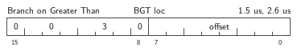
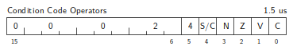

# Chapter 4. Instruction Set

This chapter Presents the order code for the PDP-11. Each PDP-11 instruction
is described in terms of five parameters: operation, effect on condition
codes, base timing, assembler mnemonics, and octal representation. Special
comments are included where appropriate.

## Notation

The following notations will be used in this section:

| Notation	| Description				|
| ------------- | ------------------------------------- |
| (XXX)		| The contents of XXX			|
| src		| The Source Address			|
| dst		| The Destination Address		|
| ∧		| Boolean “AND” Function		|
| ∨		| Boolean “OR” Function			|
| ⩝		| Boolean “Exclusive OR” Function	|
| ~		| Boolean ‘NOT” Function (Complement)	|
| →		| “becomes”				|
| ↑		| “is popped from the stack”		|
| ↓		| “is pushed onto the stack”		|

## Instruction Timing

The PDP-11 is an asynchronous processor in which, in many cases, memory and
processor operations are overlapped. The execution time for an instruction is
the sum of a basic instruction time and the time to determine and fetch the
source and/or destination operands. The following table shows the addressing
times required for the various modes of addressing source and destination
operands. The instruction time for each operation is given (throughout this
chapter) for the 11/20 configuration. All times stated are subject to ±20%
variation.

| Addressing Form (src or dst)	| Timing src (μs)[^1]	| Timing dst (μs)[^1]	|
| ----------------------------- | --------------------- | --------------------- |
| R				| 0			| 0			|
| (R) or @R			| 1.5			| 1.4[^2]		|
| (R)+				| 1.5			| 1.4[^2]		|
| -(R)				| 1.5			| 1.4[^2]		|
| @(R)+				| 2.7			| 2.6[^2]		|
| @-(R)				| 2.7			| 2.6[^2]		|
| BASE(R)			| 2.7			| 2.6[^2]		|
| @BASE(R) or @(R)		| 3.9			| 3.8[^2]		|

[^1]: referencing bytes at odd addresses adds 0.6 μs to src and dst times.

[^2]: dst time is .4 μs less than listed time if instruction was a CoMPare,
CoMPare Byte, Bit Test, Bit Test Byte, TeST, or TeST Byte, none of which ever
modify the destination word.

## Double Operand Instructions

Double Operand Instructions are represented in assembly language as:
```asm
	OPR  src, dst
```
where src and dst are the addresses of the source and destination operands
respectively. The execution time for these operations is comprised of the
source time, the destination time, and the instruction time. The source and
destination times depend on addressing modes and are described in the
preceding table.

### Arithmetic Operations

#### MOV


Operation: (src) → (dst)

Condition Codes:

* N: set if (src) < 0; cleared otherwise
* Z: set if (src) = 0; cleared otherwise
* V: cleared
* C: not affected

Description: Moves the source operand to the destination location. The
previous contents of the destination are lost. The contents of the source are
not affected.

The MOV instruction is a generalization of “load,” “store,” “setup,” “push,”
“pop,” and interregister transfer operations.

General registers may be loaded with the contents of memory addresses with
instructions of the form:
```asm
	MOV  src, R
```

Registers may be loaded with a counter, and pointer values with MOV
instructions:
```asm
	MOV  #n. R	; which loads the number n into register R
```

Operands may be pushed onto a stack by:
```asm
	MOV  src, -(R)
```
and may be popped off a stack by:
```asm
	MOV  (R)+, dst
```

Interregister transfers are simply:
```asm
	MOV  RA, RB	; RA and RB are general registers
```

Memory-to-memory transfers may be done with the MOV instruction in the
general form:
```asm
	MOV  src, dst
```

#### ADD


Operation: (src) + (dst) → (dst)

Condition Codes:

* N: set if result < 0; cleared otherwise
* Z: set if result = 0; cleared otherwise
* V: set if there was arithmetic overflow as a result of the operation, that
  is, if both operands were of the same sign and the result was of the
  opposite sign; cleared otherwise
* C: set if there was a carry from the most significant bit of the result;
  cleared otherwise

Description: Adds the source operand to the destination operand and stores
the result at the destination address. The original contents of the
destination are lost. The contents of the source are not affected. Two’s
complement addition is performed.

The ADD instruction includes as special cases the “add-to-register,”
“add-to-memory,” and “add-reister-to-register” functions:
```asm
	ADD  src, R	; Add-to-Register
	ADD  R, dst	; Add-to-Memory
	ADD  RA, RB	; Add-Register-to-Register
```

Arithmetic may also be done directly in memory by the general form ADD
instruction
```asm
	ADD  src, dst
```

Use of this form saves considerable loading and storing of accumulators.

Two special cases of the ADD instruction are particularly useful in
compilers, interpreters, and other stack arithmetic processes:
```asm
	ADD  (R)+, (R)	; where R is the stack pointer
```
which replaces the top two elements of the stack with their sum; and ADD src,
(R), which increases the top element of the stack by the contents of the
source address.

The “Add Immediate” operation is yet another special case of this generalized
ADD instruction:
```asm
	ADD  #n, dst
```

Immediate operations are useful in dealing with constant operands. Note that:
```asm
	ADD  #n. R
```
steps the register R (which may be an index register) through n addresses
eliminating the need for a special “add-to-index-register” instruction.

All these special cases of the ADD instruction apply equally well to the
other double operand instructions that follow.

#### SUB


Operation: (dst) - (src) → (dst) [in detail, (dst) + ~(src) + 1 → (dst)]

Condition Codes:

* N: set if result < 0; cleared otherwise
* Z: set if result = 0; cleared otherwise
* V: set if there was arithmetic overflow as a result of the operation, that
  is, if the operands were of opposite signs and the sign of source was the
  same as the sign of the result; cleared otherwise.
* C: cleared if there was a carry from the most significant bit of the
  result; set othewise

Description: Subtracts the source operand from the destination operand and
leaves the result at the destination address. The original contents of the
destination are lost. The contents of the source are not affected.

#### CMP


Operation: (src) - (dst) [in detail, (src) + ~(dst) + 1]

Condition Codes:

* N: set if ‘result < 0; cleared ptherwise
* Z: set if result = 0; cleared otherwise
* V: set if there was arithmetic overflow; that is, operands were of opposite
  signs and the sign of the destination was the same as the sign of the
  result; cleared otherwise.
* C: cleared if there was a carry from the most significant bit of the
  result; set otherwise

Description: Arithmetically compares the source and destination operands.
Affects neither operand. The only action is to set the condition codes
appropriately.[^3]

[^3]: There is no read-modify-write cycle in the CMP, BIT. and TST
operations. This saves 0.4 μs in all destination address modes except
register mode.

### Boolean Instructions

These instructions have the same format as the double operand arithmetic
group. They permit operations on data at the bit level.

#### BIS


Operation: (src) ∨ (dst) → (dst)

Condition Codes:

* N: set if high-order bit of result set; cleared otherwise
* Z: set if result = 0; cleared otherwise
* V: cleared
* C: not affected

Description: Performs “Inclusive OR” transfer between the source and
destination operands and leaves the result at the destination address; that
is, corresponding bits set in the source are set in the destination. The
original contents of the destination are lost. The source is not affected.

#### BIC


Operation: ~(src) ∧ (dst) → (dst)

Conditions Codes:

* N: set if high-order bit of result set; cleared otherwise
* Z: set if result = 0; cleared otherwise
* V: cleared
* C: not affected

Description: The BIC instruction clears each bit in the destination that
corresponds to a set bit in the source. The original contents of the
destination are lost. The contents of the sources are unaffected.

#### BIT


Operation: (src) ∧ (dst)

Condition Codes:

* N: set if high-order bit of result set; cleared otherwise
* Z: set if result = 0; cleared otherwise
* V: cleared
* C: not affected

Description: Performs logical “and” comparison of the source and destination
operands and modifies condition codes accordingly. Neither the source nor
destination operands are affected.[^3]

The BIT instruction may be used to test whether any of the corresponding bits
that are set in the destination are also set in the source or whether all
corresponding bits set in the destination are clear in the source.

Note that the operations of BIS, BIC, and BIT are parallel in that the same
mask may be used to set, clear and test the state of particular bits in a
word.

## Branches

Branches have the instruction format


The offset is treated as a signed two’s complement displacement to be
multiplied by 2 and applied to the program counter. The program counter
points to the next word in sequence. The effect is to cause the next
instruction to be taken from an address, “loc,” located up to 127 words back
(- 254 bytes) or 128 words ahead (+ 256 bytes) of the branch instruction.
PAL-11 gives an error indication in the instruction if “loc” is outside this
range.

The PDP-11 assembler handles address arithmetic for the user and computes and
assembles the proper offsets field for branch instructions in the form
```asm
	Bxx  loc
```
where loc is the address to which the branch is to be made. The branch
instructions have no effect on condition codes.

### Unconditional Branch

#### BR


Operation: loc → (PC)

Description: Provides a way of transferring program control within a limited
range with a one word instruction. The execution time is equal to the
instruction time (2.6 μs) for the operation.

### Simple Conditional Branches

Conditioned branches combine in one instruction a conditional skip,
unconditional branch sequence.

Timing for the conditional branches is shown as execution time if the
condition is not met, followed by the execution time if the condition is met
(and a program branch occurs).

#### BEQ


Operation: loc → (PC) if Z = 1

Description: Tests the state of the Z-bit and causes a branch if Z is set. It
is used to test equality following a CMP operation, to test that no bits set
in the destination were also set in the source following a BIT operation, and
generally, to test that the result of the previous operation was zero.

Thus the sequence
```asm
	CMP  A,B	; compare A and B
	BEQ  C		; branch if they are equal
```
will branch to C if A = B (A - B = 0), and the sequence
```asm
	ADD  A,B	; add A to B
	BEQ  C		; branch if the result = 0
```
will branch to C if A + B = 0.

#### BNE


Operation: loc → (PC) if Z = 0

Description: Tests the state of the Z-bit and causes a branch if the Z-bit is
clear. BNE is the complementary operation to BEQ. It is. used to test
inequality following a CMP, to test that some bits set in the destination
were also set in the source, following a BIT and, generally, to test that the
result of the previous operation was not zero.

#### BMI


Operation: loc → (PC) if N = 1

Description: Tests the state of the N-bit and causes a branch if N is set. It
is used to test the sign (most significant bit) of the result of the previous
operation.

#### BPL


Operation: loc → (PC) if N = 0

Description: Tests the state of the N-bit and causes a branch if N is clear.
BPL is the complementary operation to BMI.

#### BCS


Operation: loc → (PC) if C = 1

Description: Tests the state of the C-bit and causes a branch if C is set. It
is used to test for a carry in the result of a previous operation.

#### BCC


Operation: loc → (PC) if C = 0

Description: Tests the state of the C-bit and causes a branch if C is clear.
BCC is the complementary operation to BCS.

#### BVS


Operation: loc → (PC) if V = 1

Description: Tests the state of the V-bit (overflow) and causes a branch if
the V-bit is set. BVS is used to detect arithmetic overflow in the previous
operation.

#### BVC


Operation: loc → (PC) if V = 0

Description: Tests the state of the V-bit and causes a branch if the V-bit is
clear. BVC is the complementary operation to BVS.

### Signed Conditional Branches

Particular combinations of the condition code bits are tested with the signed
conditioned branches. These instructions are used to test the results of
instructions in which the operands were considered as signed (two’s
complement) values.

Note that the sense of signed comparisons differs from that of unsigned
comparisons in that in signed 16-bit, two’s complement arithmetic the
sequence of values is as follows:

pic-032-1-signed

whereas in unsigned 16-bit arithmetic the sequence is considered to be

pic-032-2-unsigned

#### BLT


Operation: loc → (PC) if N ⩝ V = 1

Description: Causes a branch if the “Exclusive OR” of the N- and V-bits
are 1. Thus BLT will always branch following an operation that added two
negative numbers, even if overflow occurred.

In particular, BLT will always cause a branch if it follows a CMP instruction
operating on a negative source and a positive destination (even if overflow
occurred). Further, BLT will never cause a branch when it follows a CMP
instruction operating on a positive source and negative destination. BLT will
not cause a branch if the result of the previous operation was zero (without
overflow).

#### BGE


Operation: loc → (PC) if N ⩝ V = 0

Description: Causes a branch if N and V are either both clear or both set.
BGE is the complementary operation to BLT. Thus BGE will always cause a
branch when it follows an operation that caused addition of two positive
numbers. BGE will also cause a branch on a zero result.

#### BLE


Operation: loc → (PC) if Z ∨ (N ⩝ V) = 1

Description: Operation of BLE is similar to that of BLT but in addition will
cause a branch if the result of the previous operation was zero.

#### BGT



Operation: loc → (PC) if Z ∨ (N ⩝ V) = 0

Description: Operation of BGT is similar to BGE, except that BGT will not
cause a branch on a zero result.

### Unsigned Conditional Branches

The unsigned conditional branches provide a means of testing the result of
comparison operations in which the operands are considered as unsigned
values.

#### BHI


Operation: loc → (PC) if both C and Z = 0

Description: Causes a branch if the previous operation caused neither a carry
nor a zero result. This will happen in comparison (CMP) operations as as the
source has a higher unsigned value than the destination.

#### BLOS


Operation: loc → (PC) if C ∨ Z = 1

Description: Causes a branch if the previous operation caused either a carry
or a zero result. BLOS is the complementary operation to BHI. The branch will
occur in comparison operations as long as the source is equal to, or has a
lower unsigned value than, the destination.

#### BHIS

Comparison of unsigned values with the CMP instruction can be tested for
“higher or same” and “lower” by a simple test of the C-bit. For convenience,
the mnemonics BHIS (Branch on HIgher or Same) and BLOS (Branch on
Lower Or Same) have been defined such that BHIS = BCC and BLO = BCS.


Operation: loc → (PC) if C = 0

Description: BHIS is the same instruction as BCC.

#### BLO


Operation: loc → (PC) if C = 1

Description: BLO is the same instruction as BCS.

The following example illustrates the use of some of the instructions and
addressing modes described thus far. Two new instructions are used: INC
(INCrement) and ASL (Arithmetic Shift Left) which respectively, add 1 (INC)
and multiply an operand by 2 (ASL). Their operation is fully described later
in this chapter.

This example demonstrates the generation of a table (histogram) that shows
the frequency of occurrence of each value in another table (within a range of
values 1-100). Histogram generation (including initialization) requires 23
words. Values outside the range 1-100 are ignored.

```asm
HIST:	MOV  #OTABLE, R0	; set up to clear output table
	MOV  #-100, R1		; 100 entries in output table
CLOOP:	CLR  (R0)+		; clear next entry
	INC  R1
	BNE  CLOOP		; if not, continue clearing
	MOV  #ITABLE, R0	; set up input pointer
	MOV  #-1000, R1		; length of table
	MOV  #100, R2		; max input value
HLOOP:	MOV  (R0)+, R4		; get next input value
	BLE  NOCOUNT		; ignore if less than or equal zero
	CMP  R4, R2		; check against max value
	BGT  NOCOUNT		; ignore if greater
	ASL  R4			; 2 bytes per table entry
	INC  OTABLE (R4)	; increment proper element
NOCOUNT:
	INC  R1			; input done?
	BNE  HLOOP		; if not, continue scanning
	HALT			; histogram complete
```

Editor's note: fixed error in clearing procedure.

### The JUMP Instruction

JMP (JuMP) provides more flexible program branching then is provided with the
branch instructions. Control may be transferred to any location in memory (no
range limitation) and can be accomplished with the full flexibility of the
PDP-11 addressing modes.

#### JMP


Operation: dst → (PC)

Conditioned Codes: not affected

Description: Register mode is illegal in JMP instructions and will cause an
“illegal instruction” condition. (Program control cannot be transferred to a
register.) Register deferred mode is legal and will cause program control to
be transferred to the address held in the specified register. Note that
instructions are word data and must therefore be fetched from an
even-numbered address. A “boundary error” condition will result when the
processor attempts to fetch an instruction from an odd address.

Deferred index mode JMP instructions permit transfer of control to the
address contained in a selectable element of a table of dispatch vectors.

## Subroutines

The subroutine call in the PDP-11 provides for automatic nesting of
subroutines, reentrancy, and multiple entry points. Subroutines may call
other subroutines (or indeed themselves) to any level of nesting without
making special provision for storage of return addresses at each level of
subroutine call. The subroutine calling mechanism modifies no fixed location
in memory and thus also provides for reentrancy. This allows one copy of a
subroutine to be shared among several interrupting processes.

#### JSR


Operation:
```
dst → (tmp)	(tmp is an internal processor register)
(reg) ↓		(push reg contents onto processor stack)
(PC) → (reg)	(PC holds location following JSR; this address
(tmp) → (PC)	 now put in reg)
```

Condition Codes: not affected

Description: Execution time for JSR is the sum of instruction and destination
times. In execution of the JSR, the old contents of the specified register
(the “linkage pointer”), are automatically pushed onto the processor stack
and new linkage information placed in the register. Thus subroutines nested
within subroutines to any depth may all be called with the same linkage
register. There is no need either to plan the maximum depth at which any
particular subroutine will be called or to include instructions in each
routine to save and restore the linkage pointer. Further, since all linkages
are saved in a reentrant manner — on the processor stack — execution of a
subroutine may be interrupted, the same subroutine reentered and executed by
an interrupt service routine. Execution of the initial subroutine can then be
resumed when other requests are satisfied. This process (called nesting) can
proceed to any level.

A subroutine called with a JSR reg, dst instruction can access the arugments
following the call with either autoincrement addressing, (reg)+ (if arguments
are accessed sequentially), or by indexed addressing, X(reg) (if accessed in
random order). These addressing modes may also be deferred, @(reg)+ and
@X(reg) if the parameters are operand addresses rather than the operands
themselves.

JSR PC, dst is a special case of the PDP-11 subroutine call suitable for
subroutine calls that transmit parameters through the general registers. No
register except the program counter is modified by this call.

Another special case of the JSR instruction is JSR PC, (SP)+ which exchanges
the top element of the processor stack and the contents of the program
counter. Use of this instruction allows two routines to swap program control
and resume operation when recalled where they left off. Such routines are
called “co-routines.”

#### RTS

Return from a subroutine is done by the RTS instruction: RTS reg loads the
contents of the reg into the PC and pops the top element of the processor
stack into the specified register.


Operation:

    (reg) → (PC)
          ↑ (reg)

Condition Codes: not affected

Description: Loads content of reg into PC and pops the top element of the
processor stack into the specified register. Execution time for RTS is equal
to the basic instruction time.

Return from a subroutine is typically made through the same register that was
used in its call. Thus, a subroutine called with a JSR PC, dst exits with a
RTS PC and a subroutine called with a JSR R5, dst, picks up parameters with
addressing modes (R5)+, X(R5), or @X(R5) and finally exits with a RTS R5.

### Programming Examples of the Use of Subroutines

#### 1. Passing arguments in subroutine calls

The subroutine TOLER checks each element in an array of unsigned integers to
determine whether any elements are outside specified limits. If all are
within tolerance, the value 0 is returned in the register R0. If TOLER find
an element out of tolerance, it returns the address of the bad element + 2 in
R0. The calling sequence for TOLER is:

```asm
	JSR  R5, TOLER
	.WORD ARRAY	; address of array to be checked (WORD
			; expresision — defines a word equal to
			; the value of the expression)
	.WORD -LENGTH	; minus # of items in array
	.WORD HILIM	; upper limit of tolerance
	.WORD LOLIM	; lower limit of tolerance
			; subroutine returns here
```

```asm
; Tolerance Check -- Array Elements Within Limits?

TOLER:	MOV  (R5)+, R0	; get array address
	MOV  (R5)+, R1	; get minus the length
	MOV  (R5)+, R2	; get high tolerance limit
	MOV  (R5)+, R3	; get low tolerance limit
TLOOP:	MOV  (R0)+, R4	; get next element of array
	CMP  R4, R2	; check it against high limit
	BHI  TEXIT	; leave routine if higher
	CMP  R4, R3	; check it against low limit
	BLO  TEXIT	; leave routine if lower
	INC  R1		; increment count, check
			; whether at end of array
	BNE  TLOOP	; contihue if not at end yet
	CLR  R0		; exit with R0 = 0 if all ok
TEXIT:	RTS  R5		; return, R0 holds poirter or 0
```

The instruction INC R1 increases the contents of R1 by 1 and the instruction
CLR R0 zeroes the register R0.

#### 2. Saving and restoring registers on the stack

This subroutine pushes R0-R5 onto the stack. It is called by:

```asm
	JSR  R5, SAVE
```

```asm
SAVE:	MOV  R4, -(SP)	; R5 was pushed by the JSR
	MOV  R3, -(SP)	; R5 will be at the bottom of the stack
	MOV  R2, -(SP)	; R4, R3, R2, R1, and R0 in order
	MOV  R1, -(SP)	; will be above it
	MOV  R0, -(SP)	; RO is at the top of the stack
	JMP  R5		; R5 holds the return address
```

The TST operation is equivalent to comparing the operand with 0, i.e.,

```asm
	TST  opr = CMP  opr, #0
```

The only effect is to set the appropriate condition codes.

The following example illustrates a subroutine to restore R0-R5 from the
stack.

```asm
	JSR  R5, REST
```

```asm
REST:	TST  (SP)+	; this increments the SP by 2
	MOV  (SP)+, R0	; the registers are restored in reverse
	MOV  (SP)+, R1	; order to that in which they were put on
	MOV  (SP)+, R2	; the stack
	MOV  (SP)+, R3	;
	MOV  (SP)+, R4	;
	RTS  R5		; R5 is loaded into the PC and the old R5
			; restored
```

The operation TST (SP)+ removes the top element on the stack. At the time it
is used, the top element holds the contents of R5 that were saved by the call
to REST. Since R5 is to be loaded with the value saved on the stack by SAVE,
this information is not needed.

#### 3. Stacks, recursion, and nesting

The following subroutine converts an unsigned binary integer to a string of
typed ASCII characters. In the routine, the remainders of successive
divisions by 10 are saved and then typed in reverse order.

The operation of the subroutine is to call a part of itself (beginning with
DECREM) repeatedly until a zero quotient is calculated by an integer divide
subroutine, IDIVR. At each iteration, the dividend is divided by 10, the
resulting quotient replaces the dividend, and the remainder is pushed onto
the processor stack. The processor stack thus holds interleaved data
(remainders) and control information (return addresses from calls to DECPNT
and DECREM) when the quotient finally comes up as 0 and the branch is made to
DECTTY. The portion of the routine beginning at DECTTY then pops a remainder
from the stack, converts it to an ASCII character, types it and then returns
control to DECTTY (with RTS PC) until the stack is reduced finally to its
state immediately after the call to DECPNT. At this point execution of RTS PC
returns control to the main program.

A character is typed in DECTTY by loading the teleprinter buffer (TPB) and
waiting for the teleprinter READY flag, the most significant bit of the
low-order byte of the teleprinter status word (TPS), to be set.

The symbols CR and LF are assumed equal to the ASCII representations for
carriage return and line feed respectively.

This subroutine types the unsigned integer in R0. It illustrates recursion
and the use of stacks.

```asm
DECPNT:	MOV  #10, R2	; set up divisor of 10
DECREM:	JSR  PC, IDIVR	; subroutine divides (R0) by (R2)
	MOV  R1, -(SP)	; quotient is in R0, remainder is in R1
	TST  R0		; after pushing remainder onto stack test
			; quotient
	BEQ  DECTTY	; if the quotient is 0, we‘re done getting
			; remainders
	JSR  PC, DECREM	; if not try again
DECTTY:	MOV  (SP)+, R0	; get next remainder
	ADD  #60, R0	; make an ASCII character

TTYOUT:	MOV  R0, TPB	; type the ASCII character in R0
TTYLUP:	TST  TPS	; wait for the teleprinter to be done
	BPL  TTYLUP	; TPS is negative when the TP is done
	CMP  #CR, R0	; was the character of a carriage return
	BEQ  TTYLF	; if not -- return, if so -- get a line feed
	RTS  PC		; returns either to DECTTY or main program
TTYLF:	MOV  #LF, R0	; type a line feed and wait for it to be
	BR   TTYOUT	; completted
```

Editor's note: Fixed the infinite loop error while printing LF.

#### 4. Multiple entry points

In the example that follows, the subroutines described above are used to type
out all the entries in a table of unsigned integers that are not within
specified tolerance.

The subroutine TOLER is entered at TOLER for initialization and at TLOOP to
pick up each bad entry of the array after the first one.

The subroutine DECPNT is entered at DECPNT to print the value of the unsigned
binary number held in R0 and at TTYOUT to print the ASCII character held in
R0. TTYOUT prints the carriage return, line feed sequence when it sees the
carriage return character.

This routine types all out-of-tolerance elements of an integer array. The
program starts at TYPOUT.

```asm
TYPFIN:	HALT		; suspend processor operation, wait
			; for key continue
TYPOUT:	JSR  R5, TOLER	; get address of bad item
			; initialization entry
	.WORD ARRAY	; address of array
	.WORD -LENGTH	; -length of array
	.WORD HILIM	; high limit
	.WORD LOLIM	; low limit
TYPCHK:	BEQ  TYPFIN	; Z-bit is set if no more out of limits
	JSR  R5, SAVE	; save registers
	MOV  -(R0), R0	; R0 holds address + 2, get operand into R0
	JSR  PC, DECPNT	; print out number
	MOV  #CR, R0	; type CR, LF
	JSR  PC, TTYOUT	; note use of second entry point
	JSR  R5, REST	; restore registers
	JSR  R5, TLOOP	; continue searching array, alternate entry
	BR   TYPCHK	; another bad element?
```

## Single Operand Instructions

Single Operand Instructions are represented as:


The execution time for single operand instructions is the sum of the basic
instruction time and destination address time for the operation.

### General Operations

#### CLR


Operation: 0 → (dst)

Condition Codes:

* N: cleared
* Z: set
* V: cleared
* C: cleared

Description: Zeroes the specified destination.

#### INC


Operation: (dst) + 1 → (dst)

Condition Codes:

* N: set if the result is < 0; cleared otherwise
* Z: set if the result is 0; cleared otherwise
* V: set if (dst) held 077777; cleared otherwise
* C: not affected

Description: Adds 1 to the contents of the destination.

#### DEC


Operation: (dst) - 1 → (dst)

Condition Codes:

* N: set if the result is < 0; cleared otherwise
* Z: set if the result is 0; cleared otherwise
* V: set if (dst) was 100000; cleared otherwise
* C: not affected

Description: Subtracts 1 from the contents of the destination.

#### NEG


Operation: -(dst) → (dst)

Condition Codes as in SUB dst, #0:

* N: set if the result is < 0; cleared otherwise
* Z: set if the result is 0; cleared otherwise
* V: set if the result is 100000; cleared otherwise
* C: cleared if the result is 0; set otherwise

Description: Replaces the contents of the destination address by their two’s
complement. (However, 100000, is replaced by itself — in two’s complement
notation the most negative number has no positive counterpart.)

#### TST


Operation: 0 - (dst)

Condition Codes as in CMP #0, dst:

* N: set if the result is < 0; cleared otherwise
* Z: set if the result is 0; cleared otherwise
* V: cleared
* C: cleared

Description: Sets the condition codes Z and N according to the contents of
the destination address.[^4]

[^4]: See the note for the CMP instruction.

#### COM


Operation: ~(dst) → (dst)

Condition Codes:

* N: set if most significant bit of result set; cleared otherwise
* Z: set if result is 0; cleared otherwise
* V: cleared
* C: set

Description: Replaces the contents of the destination address by their
logical complement (each bit equal to 0 is set and each bit equal to 1 is
cleared).

### Multiple Precision Operations

It is sometimes convenient to do arithmetic on operands considered as
multiple words. The PDP-11 makes special provision for such operations with
the instructions ADC (ADd Carry) and SBC (SuBtract Carry).

#### ADC


Operation: (dst) + (C) → (dst)

Condition Codes:

* N: set if result < 0; cleared otherwise
* Z: set if result = 0; cleared otherwise
* V: set if (dst) was 077777 and (C) was 1; cleared otherwise
* C: set if (dst) was 177777 and (C) was 1; cleared otherwise

Description: Adds the contents of the C-bit into the destination. This
permits the carry from the addition of the two low-order words to be carried
into the high-order result.

Double precision addition may be done with the following instruction
sequence:
```asm
	ADD  A0, B0	; add low-order parts
	ADC  B1		; add carry into high-order
	ADD  A1, B1	; add high-order parts
```

#### SBC


Operation: (dst) - (C) → (dst)

Condition Codes:

* N: set if the result < 0; cleared otherwise
* Z: set if the result 0; cleared otherwise
* V: set if the result is 100000; cleared otherwise (???)
* C: cleared if the result is 0 and C = 1; set otherwise (???)

Description: Subtracts the contents of the C-bit from the destination. This
permits the carry from the subtraction of two low-order words to be
subtracted from the high-order part of the result.

Double precision subtraction is done by:
```asm
	SUB  A0, B0
	SBC  B1
	SUB  A1, B1
```

Double precision negation is accomplisheg bith:
```asm
	NEG  B0		; negate low-order part; sets C unless B0 = 0
	SBC  B1		; makes “NEG B1” = “COMB B1” unless B0 = 0
	NEG  B1		; negate high-order part
```

### Rotates

Testing of sequential bits of a word and detailed bit manipulation are aided
with rotate operations. The instructions ROR (ROtate Right) and ROL (ROtate
Left) cause the C-bit of the status register to be effectively appended to
the destination operand in circular bit shifting.

pic-042-1-rotates

#### ROR


Condition Codes:

* N: set if the high-order bit of the result is set; cleared otherwise
* Z: set if all bits of result = 0; cleared otherwise
* V: loaded with the Exclusive OR of the N-bit and C-bit (as set by the
  completion of the rotate operation)
* C: loaded with the low-order bit of the destination

Description: Rotates all bits of the destination right one place. Bit 0 is
loaded into the C-bit of the status word and the previous contents of the
C-bit are loaded into bit 15 of the destination.

#### ROL


Condition Codes:

* N: set if the high-order bit of the result word is set; cleared otherwise
* Z: set if all bits of the result word = 0; cleared otherwise
* V: loaded with the Exclusive OR of the N-bit and C-bit (as set by the
  completion of the rotate operation)
* C: loaded with the high-order bit of the destination

Description: Rotates all bits of the destination left one place. Bit 15 is
loaded into the C-bit of the status word and the previous contents of the
C-bit are loaded into bit 0 of the destination.

#### SWAB


Condition Codes:

* N: set if high-order bit of low-order byte (bit 7) of result is set;
  cleared otherwise
* Z: set if low-order byte of result = 0; cleared otherwise
* V: cleared
* C: cleared

Description: Exchanges high-order byte and low-order byte of the destination
word (dst must be a word address).

### Shifts

Scaling data by factors of 2 is accomplished by the shift instructions:

* ASR — Arithmetic Shift Right
* ASL — Arithmetic Shift Left

The sign bit (bit 15) of the operand is replicated in shifts to the right.
The low-order bit is filled with 0 in shifts to the left. Bits shifted out of
the C-bit are lost.

#### ASR


Condition Codes:

* N: set if the high-order bit of the result is set; cleared otherwise
* Z: set if the result = 0; cleared otherwise
* V: loaded from the Exclusive OR of the N-bit and C-bit (as set by the
  completion of the shift operation)
* C: loaded from the low-order bit of the destination

Description: Shifts all bits of the destination right one place. Bit 15 is
replicated. The C-bit is loaded from bit 0 of the destination. ASR performs
signed division of fhe destination by 2.

#### ASL


Condition Codes:

* N: set if the high-order bit of the result is set; cleared otherwise
* Z: set if the result = 0; cleared otherwise
* V: loaded with the Exclusive OR of the N-bit and C-bit (as set by the
  completion of the shift operation)
* C: loaded with the high-order bit of the destination

Description: Shifts all bits of the destination left one place. Bit 0 is
loaded with a 0. The C-bit of the status word is loaded from the most
significant bit of the destination. ASL performs a signed multiplication of
the destination by 2.

Multiple precision shifting is done with a sequence of shifts and rotates.

Double Precision Right Shift:
```asm
	ASR  A1		; low-order bit of A1 to C-bit
	ROR  A0		; C-bit to high-order bit of A0
```

Double Precision Left Shift:
```asm
	ASL  A0		; high-order bit of A0 to C-bit
	ROL  A1		; C-bit to low-order bit of A1
```

Normalization of operands (scaling of the operand until the operand taken as
a 15-bit fraction with sign is in the range -½ < operand ≤ ½) proceeds as
follows:
```asm
NORM:	ASL  A		; shift O’s into low-order bit
	BEQ  NFIN	; if the result is 0, the operation is complete
	BVC  NORM	; if the sign did not change, continue
	ROR  A		; restore the sign
	BR   NDONE	; normalization complete
NFIN:	ROR  A		; restore the sign: 000000 or 100000
	ASR  A		; and replicate it: OOOOOO or 140000
NDONE:	...
```

Double precision normalization proceeds similarly:
```asm
DNORM:	ASL  A0		; double precision left shift
	ROL  A1		;
	BEQ  DZERO	; high order result 0? if so, check low
	BVC  DNORM	; if the sign did not change, continue
	ROR  A1		; restore the sign
	BR   DNDONE	; normalization complete
DZERO:	TST  A0		; low order zero, too?
	BNE  DN0RM	; if not, continue normalization
	ROR  A1		; restore the sign; 000000 or 100000
	ASR  A1		; and replicate it: 000000 or 140000
DNDONE: ...
```

The following example illustrates the use of shifts and rotates in a 16-bit
unsigned integer multiply subroutine. Access of operands through address
parameters following the subroutine is also shown. The multiplication takes
115-170 μs in in-line code. The entire subroutine as shown below takes
approximately 200 μs and requires 16 words. The calling sequence is
```asm
	JSR  R5, MULT
	.WORD MCAND	; address of multiplicand
	.WORD MPLIER	; address of multiplier
	.WORD PROD	; address of product
```

```asm
MULT:	CLR  R0
	MOV  @(R5)+, R1	; get multiplier into R1
	MOV  @(R5)+, R2	; get multiplicand into R2
	MOV  #-16, R3	; set counter
MLOOP:	ASL  R0		; double prec. shift
	ROL  R1		; shift and add multiply
	BCC  NOADD	; most significant bit governs add
	ADD  R2, R0	; if set add in multiplicand
	ADC  R1		; keep 32-bit product
NOADD:	INC  R3		; done?
	BNE  MLOOP	; if not continue
	MOV  (R5)+, R2	; get address to store product
	MOV  R0, (R2)+	; put low-order away, move to high
	MOV  R1, (R2)	; put high-order away
	RTS  R5		; return to calling program
```

## Byte Operations

The PDP-11 processor includes a full complement of instructions that
manipulate byte operands. Addressing is byte-oriented so that instructions
for byte manipulation are straightforward. In addition, byte instructions
with autoincrement or autodecrement direct addressing cause the specified
register to be stepped by one to point to the next byte of data. Byte
operations in register mode access the low-order byte of the specified
register. These provisions enable the PDP-11 to perform as either a word or
byte processor.

Timing of byte instructions is the same as for word instructions except that
an additional 0.6 μs is required for access of bytes at odd addresses.

### Double Operand Byte Instructions

#### MOVB


Operation: (src) → (dst)

Condition Codes: Set on the byte result as in MOV

Description: Same as MOV instruction. The MOVB instruction in register mode
(unique among byte operations) extends the most significant bit of the byte
register (sign extension). Otherwise MOVB operates on bytes exactly as MOV
operates on words.

#### CMPB


Operation: (src) - (dst) [in detail, (src) + ~(dst) + 1]

Condition Codes: Set on the byte result as in CMP

Description: Same as CMP instruction.[^5]

#### BISB


Operation: (src) ∨ (dst) → (dst)

Condition Codes: Set on the byte result as in BIS.

Description: Same as BIS.

#### BICB


Operation: ~(src) ∧ (dst) → (dst)

Condition Codes: set on the byte result as in BIC.

Description: Same as BIC.

#### BITB


Operation: (src) ∧ (dst)

Condition Codes: Set on the byte result as in BIT.

Description: Same as BIT.[^5]

The following subroutine scans a packed character string of variable length
lines, removes blanks and unpacks the string to left-justified length lines.
INSTRING is the address of the INput STRING, OUTSTRING is the address of the
OUTput String. EOLCHAR, SPCHAR, and EORCHAR are the End Of Line CHARacter,
Space CHARacter, and End Of Record CHARacter respectively.

[^5]: See the note for the CMP instruction.

LNLINE is the Length of uNpacked LINES. The routine requires 24 words.

```asm
EDIT:	MOV  #INSTRING, R0	; set up input byte pointer
	MOV  #OUTSTRING, R1	; set up output byte pointer
	MOV  #EOLCHAR, R2	; put high use constant in register
	MOV  #SPCHAR, R3	; to save time in loop
NOLINE:	MOV  #LNLINE, R4	; R4 holds # char left in line
NXTCHR:	MOVB (R0)+, R5		; get next byte
	CMP  R5, R2		; end of line?
	BEQ  FILINE		; if yes, fill line
	CMP  R5, R3		; blank?
	BEQ  NXTCHR		; if yes, skip character
	DEC  R4			; decrement # of characters left in line
	MOVB R5, (R1)+		; move byte to output string
	BR   NXTCHR		; continue
FILINE:	CLRB (R1)+		; put a blank byte in output
	DEC  R4			; decrement # char left
	BNE  FILINE		; continue if not end
CHKEND:	CMPB (R0), #EORCHAR	; end of record?
	BNE  NOLINE		; if not EOR, start next line
```

### Single Operand Byte Instructions

#### CLRB


Operation: 0 → (dst)

Condition Codes: Set on the byte result as in CLR.

Description: Same as CLR.

#### INCB


Operation: (dst) + 1 → (dst)

Condition Codes: Set on the byte result as in INC.

Description: Same as INC. The carry from a byte does not affect any other byte.

#### DECB


Operation: (dst) - 1 → (dst)

Condition Codes: Set on the byte result as in DEC.

Description: Same as DEC.

#### NEGB


Operation: -(dst) → (dst) [in detail, ~(dst) + 1 → (dst)]

Condition Codes: Set on the byte result as NEG.

Description: Same as NEG.

#### TSTB


Operation: 0 - (dst)

Condition Codes: Set on the byte result as TST.

Description: Same as TST.[^6]

[^6]: See the note for the CMP instruction.

#### COMB


Operation: ~(dst) → (dst)

Condition Codes: Set on the byte result as COM.

Description: Same as COM.

#### ADCB


Operation: (dst) + (C) → (dst)

Condition Codes: Set on the byte result as ADC.

Description: Same as ADC.

#### SBCB


Operation: (dst) - (C) → (dst)

Condition Codes: Set on the byte result as SBC.

Description: Same as SBC.

#### RORB


Operation: As in ROR on byte operands.

Condition Codes: Set on the byte result as ROR.

Description: Same as ROR.[^7]

#### ROLB


Operation: As in ROL on byte operands.

Condition Codes: set on the byte results as ROL.

Description: Same as ROL.[^7]

#### ASRB


Operation: Aas in ASR on byte operands.

Condition Codes: set on the byte result as ASR.

Description: Same as ASR.[^7]

#### ASLB


Operation: As in ASL on byte operands.

Condition Codes: set on the byte results as ASL.

Description: Same as ASL.[^7]

[^7]: Shift and rotate operations require an additional 0.6 μs to access
bytes at odd addresses.

## Condition Code Operators

Condition code operators set and clear condition code bits. Selectable
combinations of these bits may be cleared or set together in one instruction.



Condition code bits corresponding to bits in the condition code operator
(bits 3-0; N, Z, V, C) are modified according to the sense of bit 4, the
set/clear bit of the operator. The following mnemonics are permanent symbols
in the assembler:

| Mnemonic | Operation | Op Code | Mnemonic | Operation | Op Code |
| -------- | --------- | ------- | -------- | --------- | ------- |
| CLC      | Clear C   | 000241  | SEC      | Set C     | 000261  |
| CLV      | Clear V   | 000242  | SEV      | Set V     | 000262  |
| CLZ      | Clear Z   | 000244  | SEZ      | Set Z     | 000264  |
| CLN      | Clear N   | 000250  | SEN      | Set N     | 000270  |

Timing for all condition code operators is the basic instruction time (1.5
μs) for the operators. (The codes 000240 and 000260 are the shortest
“no-operation” instructions.)

Combinations of the above set or clear operations may be ORed together to
form new instruction mnemonics. For example: CLCV = CLC ! CLV. The new
instruction clears C and V bits. (“!” signifies “inclusive or” in PAL-11.)

## Miscellaneous Control Instructions

### RESET


Condition Codes: Not affected.

Description: Sends an INIT pulse along the Unibus by the processor. All
devices on the bus are reset to their state at power-up.

### WAIT


Condition Codes: Not affected.

Description: Provides a way for the processor to relinquish use of the bus
while it waits for an external interrupt. Having been given a WAIT command,
the processor will not compete for bus use by fetching instructions or
operands from memory. This permits higher transfer rates between a device and
memory, since no processor-induced latencies will be encountered by bus
requests from the device. In WAIT, as in all instructions, the PC points to
the next instruction following the WAIT operation.

Thus when an interrupt causes the PC and PS to be pushed onto the processor
stack, the address of the next instruction following the WAIT is saved. The
exit from the interrupt routine (i.e. execution of an RTI instruction) will
cause resumption of the interrupted process at the instruction following the
WAIT.

### HALT


Condition Codes: Not affected.

Description: Causes the processor operation to cease. The console is given
control of the bus. The console data lights display the contents of R0; the
console address lights display the address of the halt instruction. Transfers
on the Unibus are terminated immediately. The PC points to the next
instruction to be executed. Pressing the continue key on the console causes
processor operation to resume. No INIT signal is given.

### Processor Traps

Processor Traps are internally generated interrupts. Error conditions,
completion of an instrustion in trace mode (i.e. T-bit of status word set),
and certain instructions cause traps. As in interrupts, the current PC and PS
are saved on the processor stack and a new PC and PS are loaded from the
appropriate trap (interrupt) vector. See Appendix C for a summary of Trap
Vector Addresses.

### Trap Instructions

Trap Instructions provide for calls to emulators, I/O monitors, debugging
packages, and user-defined interpreters.

#### EMT


Operation:

    (PS) ↓ SP
    (PC) ↓ SP
    (30) → PC
    (32) → PS

Condition Codes: Loaded from trap vector.

Description: Performs a trap sequence with a trap vector address of 30. All
operation codes from 104000 to 104377 are EMT calls. The low-order byte, bits
0-7 of the EMT instructions, may be used to transmit information to the
emulating routine (e.g., function to be performed). The trap vector for EMT
is at address 30. The new PC is taken from the word at address 30; the new
central processor status (PS) is taken from the word at address 32.

#### TRAP


Operation: As in EMT except the trap vector is located at 34.

Condition Codes: Loaded from trap vector.

Description: Performs a trap sequence with a trap vector address of 34.
Operation codes from 104400 to 104777 are TRAP instructions. TRAPS and EMTs
are identical in operation, except that the trap vector for TRAP is at
address 34.

#### IOT


Operation: As EMT except the trap vector is located at address 20 and no
information is transmitted in the low byte.

Condition Codes: Loaded from trap vector.

Description: Used to call the I/O executive routine IOX.

#### BPT


Operation: Same as IOT except that trap vector is located at address 14.

Condition Codes: Loaded from trap vector.

Description: Used to call debugging aids. The user is cautioned against
employing code 000003 in programs run under these debugging aids.

#### RTI


Operation:

    SP ↑ (PC)
    SP ↑ (PS).

Condition Codes: Loaded from processor stack.

Description: Used to exit from an interrupt or TRAP service routine. The PC
and PS are restored (popped) from the processor stack.

Instruction traps are also caused by attempts to execute instruction codes
reserved for future processor expansion (reserved instructions) or
instructions with illegal addressing modes (illegal instructions). Order
codes not corresponding to any of the instructions described above are
considered to be reserved instructions. Illegal instructions are JMP and JSR
with register mode destinations. Reserved and illegal instruction traps occur
as described under EMT, but trap through vectors at addresses 10 and 04
respectively.

### Stack Overflow Trap

Stack Overflow Trap is a processor trap through the vector at address 4. It
is caused by referencing addresses below 400, through the processor stack
pointer R6 (SP) in autodecrement or autodecrement deferred addressing. The
instruction causing the overflow is completed before the trap is made.

### Bus Error Traps

Bus Error Traps are:

1. Boundary Errors — attempts to reference word operands at odd addresses.

2. Time-Out Errors — attempts to reference addresses on the bus that made no
   response within 10 μs. In general, these are caused by attempts to
   reference nonexistent memory, and attempts to reference nonexistent
   peripheral devices.

Bus error traps cause processor traps through the trap vector address 4.

### Trace Trap

Trace Trap enabled by bit 4 of the PS word and causes processor traps at the
end of instruction executions. The instruction that is executed after the
instruction that set the T-bit will proceed to completion and then cause a
processor trap through the trap vector at address 14.

The following are special cases and are detailed in subsequent paragraphs.

1. The traced instruction cleared the T-bit.
2. The traced instruction set the T-bit.
3. The traced instruction caused an instruction trap.
4. The traced instruction caused a bus error trap.
5. The traced instruction caused a stack overflow trap.
6. The process was interrupted between the time the T-bit was set and the
   fetching of the instruction that was to be traced.
7. The traced instruction was a WAIT.
8. The traced instruction was a HALT.

An instruction that cleared the T-bit — Upon fetching the traced instruction
an internal flag, the trace flag, was set. The trap will still occur at the
end of execution of this instruction. The stacked status word, however, will
have a clear T-bit.

An instruction that set the T-bit — Since the T-bit was already set, setting
it again has no effect.

An instruction that caused an Instruction Trap — The instruction trap is
sprung and the entire routine for the service trap is executed. If the
service routine exists with an RTI or in any other way restores the stacked
status word, the T-bit is set again, the instruction following the traced
instruction is executed and, unless it is one of the special cases noted
above, a trace trap occurs.

An instruction that caused a Bus Error — This is treated as in an Instruction
Trap. The only difference is that the error service is not as likely to exit
with an RTI, so that the trace trap may not occur.

An instruction that caused a stack overflow — The instruction completes
execution as usual — the Stack Overflow does not cause a trap. The Trace Trap
Vector is loaded into the PC and PS, and the old PC and, PS are pushed onto
the stack. Stack Overflow occurs again, and this time the trap is made.

An interrupt between setting of the T-bit and fetch of the traced instruction
The entire interrupt service routine is executed and then the T-bit is set
again by the exiting RTI. The traced instruction is executed (if there have
been no other interrupts) and, unless it is a special case noted above,
causes a trace trap.

Note that no interrupts are acknowledged between the time of fetching any
trapped instruction (including one that is trapped by reason of the T-bit being
set) and completing execution of the first instruction of the trap service.

A WAIT — The trap occurred immediately. The address of the next instruction
is saved on the stack.

A HALT — The processor halts. When the continue key on the console is
pressed, the instruction following the HALT is fetched and executed. Unless
it is one of the exceptions noted above, the trap occurs immediately
following execution.

Trap priorities — In case multiple processor trap conditions occur
simultaneously the following order of priorities is observed (from high to
low):

1. Bus Errors
2. Instruction Traps
3. Trace Trap
4. Stack Overflow Trap

The details on the trace trap process have been described in the trace trap
operational description which includes cases in which an instruction being
traced causes a bus error, instruction trap, or a stack overflow trap.

If a bus error is caused by the trap process handling instruction traps,
trace traps, stack overflow traps, or a previous bus error, the processor is
halted.

If a stack overflow is caused by the trap process in handling bus errors,
instruction traps, or trace traps, the process is completed and then the
stack overflow trap is sprung.

