# Appendix X. Instruction Set Summary

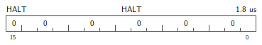

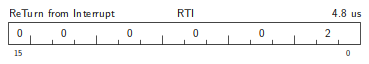
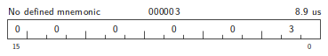
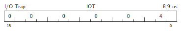
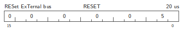

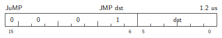

## Low Branch Block

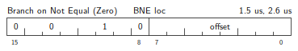
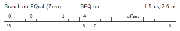
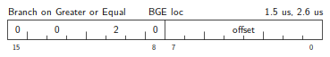
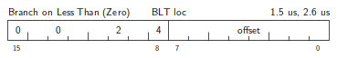

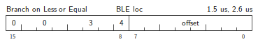

## Low Single Operand Arithmetics

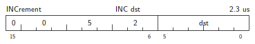
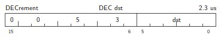
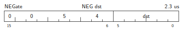

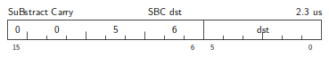

## Low Single Operand Shifts

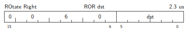
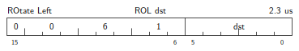

## Low Double Operand Arithmetics

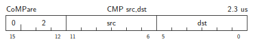
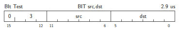
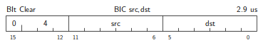
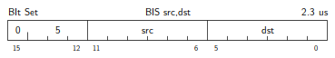
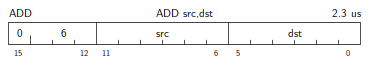

## Top Branch Block

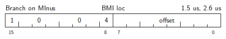

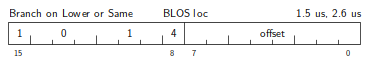
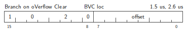
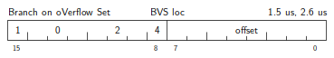

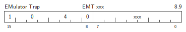

## Top Single Operand Arithmetics

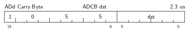
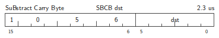

## Top Single Operand Shifts

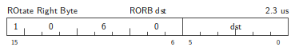
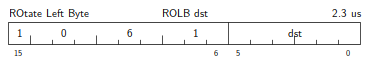

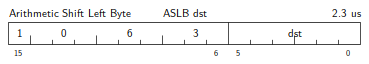

## Top Double Operand Arithmetics

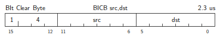

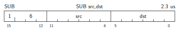

## Aliases

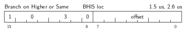
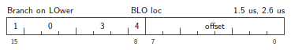

