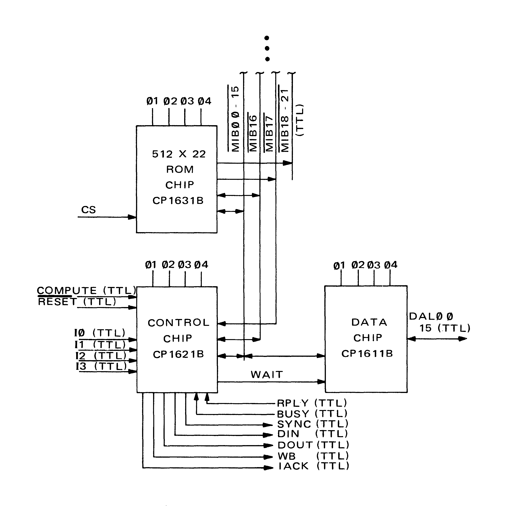
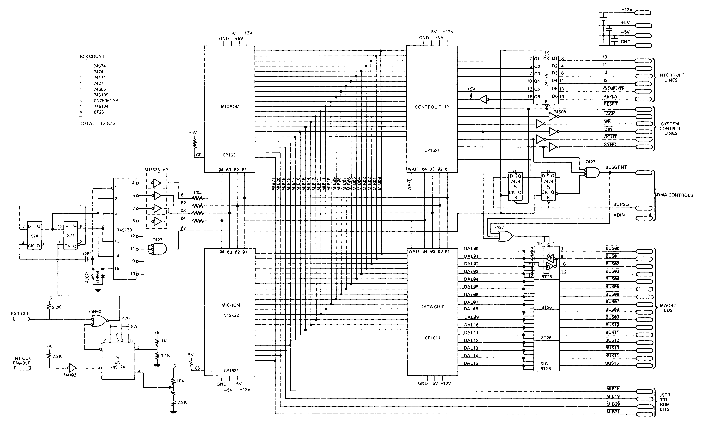

# 1 General System Configuration

## 1.1 General

The Western Digital MCP1600 microprocessor is an 8-bit microprogrammable
computer implemented with 3 MOS/LSI chips using WDC's N-channel silicon gate
process. The chip set consists of the CP1611B Data chip, the CP1621B Control
Chip, and the CP1631B microinstruction ROM (MICROM) chip.

These chips are interconnected by the 22 bit Microinstruction Bus (MIB) which
provides bi-directional communication between the chips for addresses and
instructions. A Data Access Bus provides a 16 bit port for communicating with
other system components such as memory and I/O.

The list below describes the pertinent aspects of the set:

* 8-bit Internal Organization
* 16-bit Data Access Port to Memory and I/O
* 26 Registers
* Extensive Microinstruction Set Including Decimal Operations
* Single and Double Byte Operations
* Micro and Macro Level Condition Flags
* 512 Word × 22-bit Control ROM
* Control ROM Expandable to 2048 words
* Micro Level Subroutine Capability
* Programmable Translation Array for Macroinstruction Interpretation
* Four External Interrupts and Three I nternal Interrupts
* External Instruction Set
* Power Supplies +12V, +5V, and -5V
* 3.3 MHZ Four Phase Clock (Also available in 2.75 and 2.2. MHz versions)
* TTL Compatible 3 State Interface

The MCP 1600 Microprocessor Set is easily interfaced to a variety of
applications through many of the standard product offerings of Western
Digital and other semi-conductor companies.

## 1.2 Unique Features of The MCP1600

The MCP 1600 has two uncommon and usable features that set it apart from the
standard run of MOS microprocessors.

* The MCP1600 is a vertically microprogrammable processor.
* The MCP1600 has a programmable translation array which quickly and
  automatically generates the jump vectors required for emulation and
  macroinstruction applications.

The unusual feature of being able to decode macroinstruction quickly and
automatically sets the MCP1600 apart from other devices in the microprocessor
market.

Unlike other offerings in the MOS microprocessor marketplace, the MCP1600 can
be applied to problems that demand speed for their solution. The combination
of speed (maximum 3.3 MHz instruction rate) and high density (thus great
processing power) brings the economic advantages of MOS to bear upon problems
which previously could only be attached by bipolar microprocessors or special
logic designs.

Careful review of the contents of this manual will stimulate the imaginative
user to think of many applications to which these unique features can apply
significant advantage.

## 1.3 Areas of Application

One of the unique attributes of the MCP1600 is its ability to be sensitive to
data. The Programmable Translation Array provides this ability by allowing
the address of the next instruction fetched to be determined by data, if
desired. This makes the MCP1600 highly suitable to areas of application that
require a substantial amount of data decoding. Such application might be:

* The emulation of an existing computer's instruction set.
* The invention of a new, application oriented instruction set.
* The construction of a macro-instruction processor
* The construction of a data driven processor

Another of the attributes of the MCP1600 is its ability to quickly process
data in a sophisticated manner. The availability of a rich instruction set
coupled with speed and a variety of registers make the MCP1600 especially
applicable to problems that require great quickness. Applications such as:

* Communications Multiplexing
* Host computer front ends
* Medium Speed Peripheral Device Control

can readily be attacked by the MCP 1600.

The MCP1600 provides still another advantage to the system designer. It is
truly easy to interface. Including the processor set and all other logic a
microcontroller can be implemented with as few as 15 parts. Figure 1-2 shows
such a system.

Specific application notes detailing ideas relevant the application of the
MCP1600 to the above mentioned areas are available from your Western Digital
sales representative.

## 1.4 Block Diagram

Figure 1-1 describes the interconnection of the required components of the
MCP1600 microprocessor set.

Fig 1-1. MCP1600 Microprocessor Block Diagram

The DATA CHIP (CP1611B) contains the arithmetic logic unit, the
microinstructions decode and the register file. Additionally, it contains
paths to control the operation of the processor.

The CONTROL CHIP (CP1621B) contains the program translation array, portions
of the control circuitry to control operation of the processor set, the
microinstruction counter and the I/O control system.

The MICROM CHIP (CP1631B) contains the microinstruction ROM. The MP1600
microprocessor set may be expanded up to four MICROMs giving the user a total
of 2,048 22-bit microinstructions.

The simple system illustrated in Figure 1-2 shows all of the functional
components needed to make a working microprocessor. Note that, in addition to
the three parts comprising the Microprocessor Set, twelve other available
standard TTL parts are required. These parts serve to:

* Generate the clocks
* Latch and gate input signals
* Latch and gate output signals

This is to be contrasted with some other commercially available
microprocessors which may require as many as 50 other parts to implement a
system of equivalent capability.

Fig 1-2. A Simple Microprocessor System

