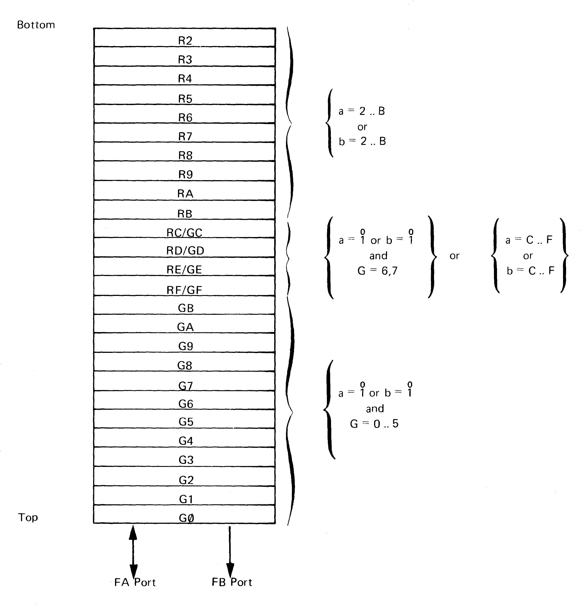
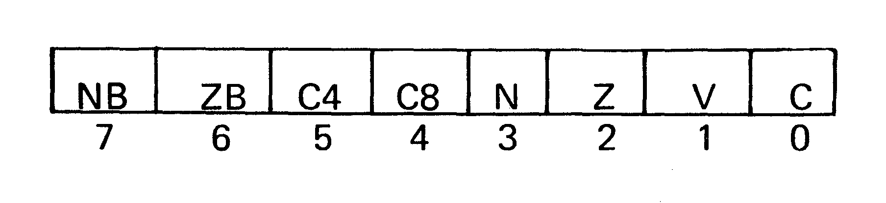

# 2 System Components

## 2.1 General

This section describes the main functional components of the MCP1600 system.
The reader should be aware that the system is physically partitioned into
three kinds of devices. He should be more interested and aware of the logical
partitioning of the system, which encompasses five areas:

* *Processing and data handling.* This is generally handled on the CP1611B
  Data Chip.

* *Next Instruction Address Generation.* This is generally handled on the
  CP1621B Control Chip.

* *Microinstruction Storage.* These are contained on one or more CP1631B
  Microinstruction ROMs.

* *Microinstruction Bus.* This bus connects the three types of devices
  together and provides a path for the microinstructions to flow from the
  microinstruction ROM to both the Control and the Data Chip.

* *Data Access Bus.* This bus provides access from the MCP 1600
  microprocessor set to the outside world. Lines comprising this data access
  bus come from all three of the chip types. Lines containing the address and
  data come from the Data Chip, control lines defining the state of the data
  access come from the Control Chip and user programmable control lines come
  from the Microinstruction ROM.

While not strictly a logic component, the clocking scheme should be noted
here.

The MCP1600 operates on a four phase clock system. While there are some
variations, the general use of each phase period is:

* ∅1 — Instruction Access
* ∅2 — Data Access
* ∅3 — Execution
* ∅4 — Data Update

The clocking scheme can be more easily understood by reference to section 3
and section 4. This section will describe the functional components that make
up these partition areas.

## 2.2 Registers

This section will describe data handling registers in the MCP1600 set of
interest to the system designer.

### 2.2.1 Register File

The Register File consists of 26, 8-bit registers which provide RAM data
storage for the MCP1600 processor set. The register file has 2 output ports
and 1 input port. Fourteen of the registers of the file can be directly
addressed by the A and/or B register designators of a microinstruction.
Additionally, the 16 top-most registers of the register file may be
considered as register pairs and can be addressed by, the G register (see
below) to permit operation on full words of data. The Register File is on the
Data Chip.

The A and the B output ports of the register file feed into the ALU.

### 2.2.2 G register

The G register is a pointer register on the Data Chip that describes the
currently accessed linked consecutive pair of registers in the register file.
Figure 2-1 describes the interaction between the G register and the register
file. Note that, when the G register is being used, access to the register
file is from the top down. This is opposed to the access to the register file
when only the A and B fields are being used as designators, in which case it
is from the bottom up. This register is loaded by IW (Input Word) and LGL
(Load G Low) instructions. IW instruction loads the G Register from the DAL
bus as specified by the *b* field of the instruction. LGL instruction loads
the G Register Ra (???).

Fig 2-1. Register File

The first (or lowest) 14 registers of the Register File are addressable only
from the MIR register. The top 12 registers are addressable only from the
G-Register. The middle 4 registers are addressable from either the G or the
MIR registers. Figure 2-1 describes the addressing conventions of this file.
It is helpful to note that if the *a* or *b* fields of the MIR are 1 or 0,
then this enables G-Register addressing.

Some Examples:

| G | a | b | A Port       | B Port       |
| - | - | - | ------------ | ------------ |
| 4 | 0 | B | G8 — 2·4 + 0 | RB           |
| 0 | 7 | 1 | R7           | G1 — 2·0 + 1 |
| 6 | 1 | 0 | GD — 2·6 + 1 | GC — 2·6 + 0 |
| 3 | 6 | A | R6           | RA           |
| 5 | 0 | 1 | GA — 2·5 + 0 | GB — 2·5 + 1 |

### 2.2.3 ALU Status Bits

The ALU provides 4 status bit outputs which reflect the result of each 8 bit
operation. The ZB and NB bits are updated after every ALU operation. C4 and
C8 are updated for Arithmetic or Shift operations. These bits may be tested
by Jump but their primary function is to pass result data from the first
cycle of a word instruction to the second cycle.

The available status bits are:

* *ZB* — Set if the result of a Byte or Word operation is zero; cleared
  otherwise.

* *NB* — Set if the high-order bit of a Byte or Word operation is a one;
  cleared otherwise (except for SRW and SRWC).

* *C4* — Set if Carry Out of Position 3 is a one; cleared otherwise. Updated
  only on Arithmetic operations. This status bit is used mainly for decimal
  arithmetic corrections.

* *C8* — Set if Carry Out of Position 7 is a one; cleared otherwise. (Note
  that this status bit is not set to borrow for subtract as is the case with
  the C Flag.) Also set if the shifted off bit of a Shift operation is a one;
  cleared otherwise.

### 2.2.4 Condition Flags

The Condition Flags consists of 4 latches which can reflect the status of the
previous ALU results. The updating of these flags can be selectively enabled
or disabled at the discretion of the microprogrammer. The condition flags are
updated with odd-numbered instruction opcodes in the range of 80-EF.

* *Z Flag* — Set if the result of a Byte or Word operation is zero, cleared
  otherwise.

* *N Flag* — Set if the high-order bit of the result of Byte or Word
  operation is (except for SRW and SRWC) is a one; cleared othewise. (Note
  that this is the complement of the sign of the result if overflow occurs.)

* *C Flag* — Monitors the carry, borrow and shifted off bits as follows:

  * *Add and Increment* — Set if there is a carry from the most significant
    bit of the Byte or Word result; cleared otherwise.

  * *Subtract and Decrement* — Set if there is a borrow (complement of carry)
    from the most significant bit of the Byte or Word result; cleared
    otherwise.

  * *Shift* — Set if the bit shifted off in a left or right shift is a one;
    cleared otherwise.

  The C Flag is not affected for operations (other than those listed above)
  even if the other flags are updated.

* *V Flag* — Set if there is an arithmetic overflow on Arithmetic operations.
  Cleared if there is no overflow and on Non-arithmetic operations. On Add
  operations overflow occurs when the sign of the two operands are the same
  and the sign of the result is different. On Subtract operations overflow
  occurs when the signs of the two operands are different and the sign of the
  result is different from the operand in Ra (V = C7 ⊻ C8).

The format of the ALU status and flag register word is shown below:

Fig 2-2. Condition Flags

### 2.2.5 MIR Register

The 16 bit MIR register holds the least significant 16 bits of the 22 bit
microinstruction currently being executed. The MIR register is loaded every
∅1 unless the currently executing microinstruction is of the 2 cycle variety.
In th is case the register is not clocked on the second occurrence of ∅1.

## 2.3 Instruction Address Generation

This section describes the register and arrays used in generating the next
microinstruction address.

### 2.3.1 Location Counter Register

The Location Counter (LC) is an 11-bit register which holds the address of
the next microinstruction to be accessed. Under normal conditions, the LC is
incremented by one after each access of a microinstruction. The LC can be
altered by other than one by execution of a Jump instruction or a RFS (Return
from Subroutine) instruction or by invoking a PTA translation.

### 2.3.2 Return Register

The Return Register (RR) holds an 11-bit address and permits a subroutine
depth of one in the microprogram. When a subroutine jump is indicated (MIB16
= 1) the return register stores the incremented contents of the LC. Contents
of the Return Register can be transferred to the LC under the control of a
Return From Subroutine (RFS).

### 2.3.3 Translation Register

The Translation Register (TR) is a 16-bit register which holds the data
presently being input to the PTA. Data on the Microinstruction Bus (MIB) is
used to load the Translation Register. Note that only the upper or lower half
of the Translation Register can be fed into Array 3 at one time.

### 2.3.4 Translation Arrays

There are four arrays on the control chip that control the generation of the
next microinstruction address. They generate new inputs into the LC register
as a function of the LC register contents, the contents of the translation
register, interrupts, and other miscellaneous inputs. The detailed operation
of these arrays is discussed in Section 4, “Programmed Translation Array
Operations”.

## 2.4 Microinstruction Bus

The Microinstruction Bus serves to interconnect the three required parts of
the MCP1600 Microprocessor set. The bus is organized into 4 distinct
sections:

* MIB15..MIB00 carry proper microinstruction data from the microinstruction
  ROM chip to both the control chip and the data chip. These lines may also
  carry data between the data chip and the control chip under certain
  conditons.

* MIB16 controls the subroutine jump operation. When MIB16 is set on a jump
  instruction, it causes the incremented contents of the LC register to be
  placed into the Return Register.

* MIB17, if set, causes the PTA on the Control Chip to perform a Read Next
  Instruction translation.

* MIB21..MIB18 are TTL level outputs that can be programmed by the user as
  his needs dictate. They are not used by the MCP 1600 Microprocessor set to
  control its operations. They are provided for the convenience of the user
  in order that he may interface to the MIB bus or control devices directly
  from the microprogram level.

## 2.5 Data Access Bus

The Data Access consists of three sections:

* Data and Address Bus,
* Outside Control Lines, and
* Incoming Control Lines.

### 2.5.1 Data and Address Bus

DAL15..DAL00 carry address and data between the data chip and the outside world.

### 2.5.2 Outside Control Lines

There are five TTL level Outgoing Control Lines that inform the outside world
of the present state of the MCP1600 set. These signals inciude

* Sync,
* Input Instruction,
* Output Instruction,
* Interrupt Acknowledge, and
* Write-Byte.

### 2.5.3 Incoming Control Lines

There are 8 TTL level Incoming Control Lines. These incoming control lines
inform the MCP1600 Microprocessor set of the state of affairs in the outside
world. There are

* four interrupt lines,
* a Compute line,
* a Reset line,
* a Reply line, and
* a Busy line.

With these lines, the MCP1600 can control a wide variety of peripheral
devices.

## 2.6 Microinstruction Storage

The microinstruction ROM (MICROM) is a 512 × 22-bit word, high speed ROM
which stores the instructions of the microprogram. The transfer of addresses
into the chip and the microinstruction out of the chip are performed over the
MIB. Address is received from push-pull drivers in the Control Chip on ∅2.
The decoding takes place on ∅3. On ∅4 the selected microinstruction is
internally accessed and the MIB is precharged. The accessed microinstruction
is placed on MIB15..MIB0 for transfer to the Data Chip and Control Chip
during ∅1.

