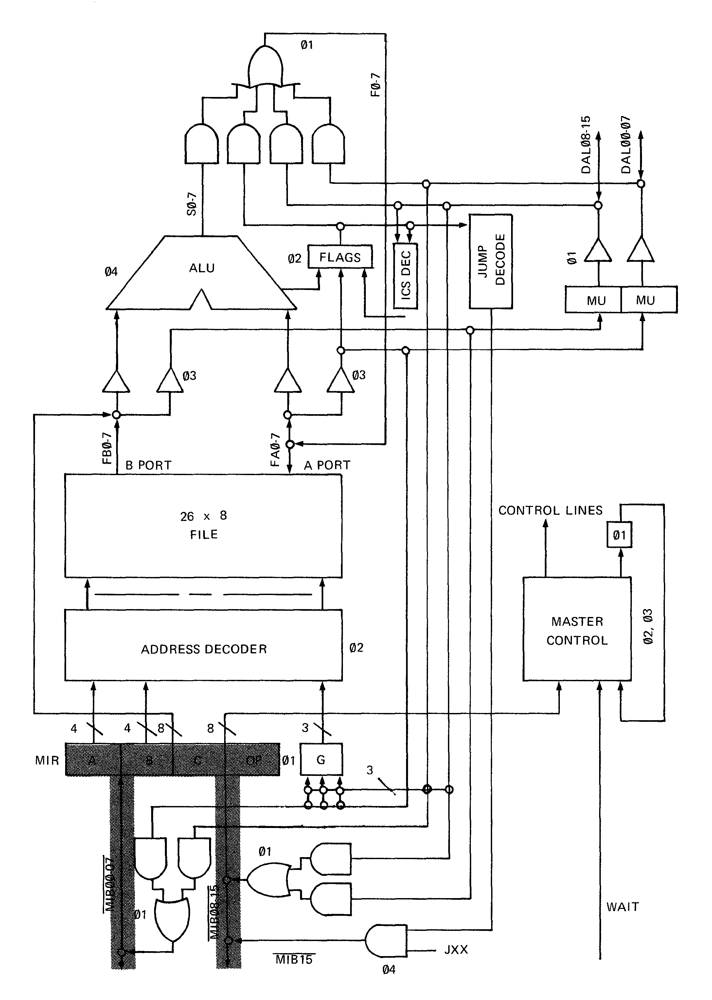
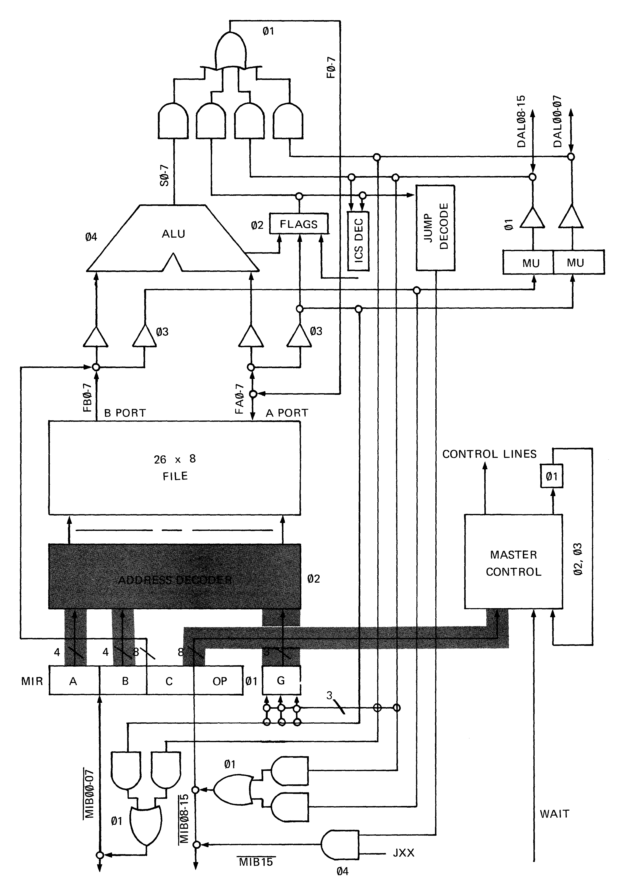
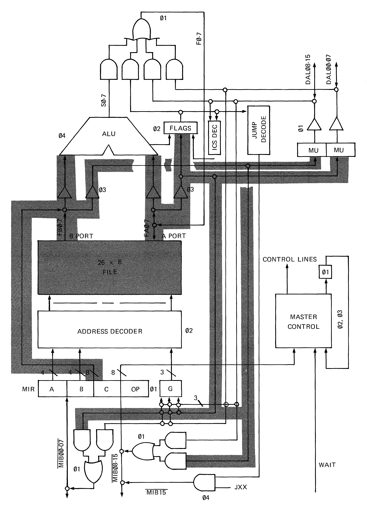
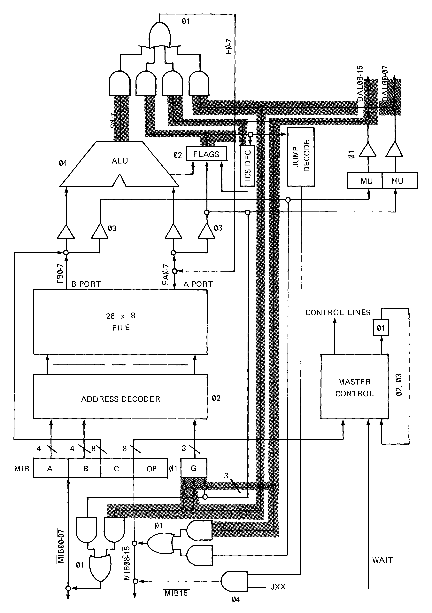
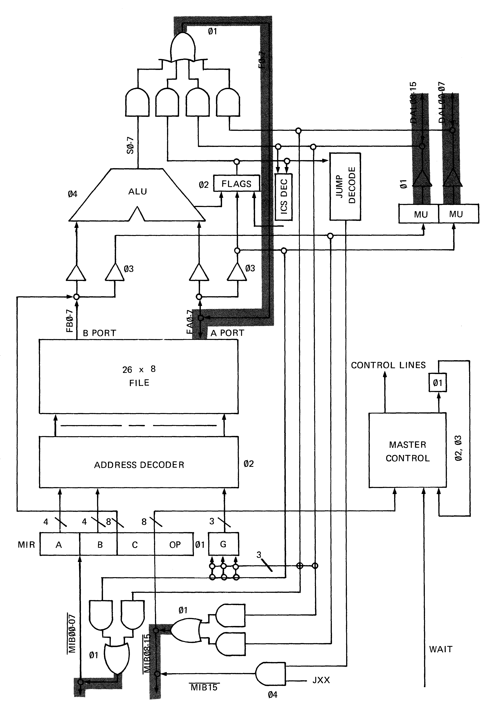
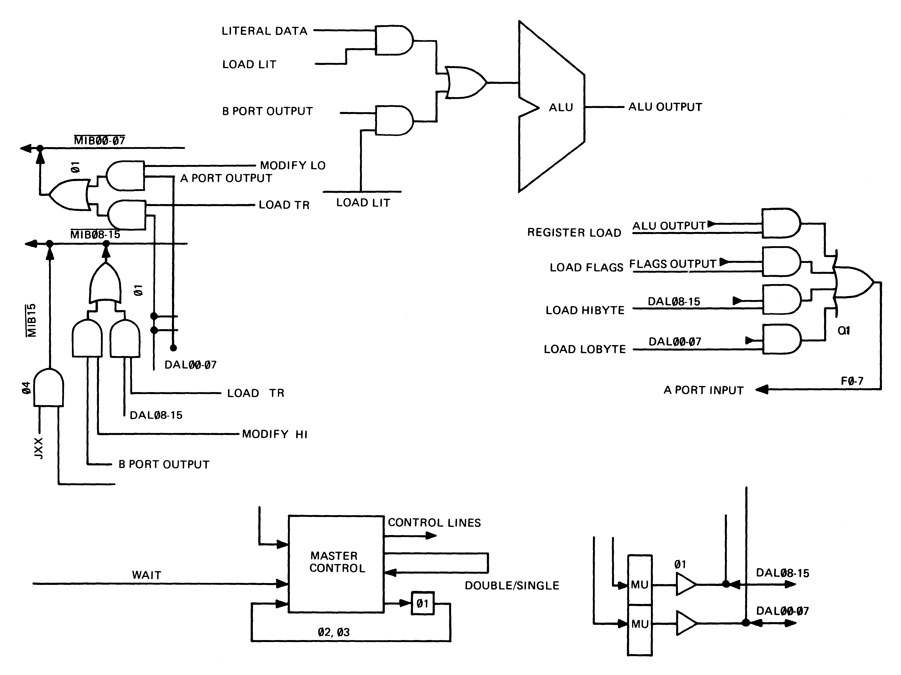

# 3 CPU Operations

## 3.1 General

This section describes the internal workings of the Data Chip, the CPU of the
MCP1600 system. Its purpose is to provide the designer with a background
understanding to enable him to more effectively interface with the Micro
Instruction Bus (MIB) and the Data Access.

The description of the MCP1600 Processor must proceed from the knowledge that
there are two important and distinct partitions to the processor. The first
partition, called the Data Chip, provides classical stored program
processing. The Data Chip consists of:

* A register file
* An arithmetic logic unit
* A Microinstruction register
* A register file address decoder
* A control signal generation function
* Condition flags
* Jump decoding
* Input/Output gating

The data chip is responsible for data manipulation as a result of instruction
execution.

The second partition, the Control Chip, generates address data that directs
the accessing of the next microinstruction to be executed. This address
generation mechanism provides the MCP1600 with its unique emulation
capabilities. While the Data Chip is executing the presently fetched
microinstruction, the Control Chip is performing a transformation upon the
presently executing macroinstruction to determine the address from which to
fetch the next microinstruction to be executed.

The description of the processor proceeds by first outlining the operation of
the Data Chip (CPU) and then in the following section outlining the operation
of the Control Chip. It is important to note that the two chips are not
synchronized except by a common clock and the fact that the contents of the
MI register on the Control Chip and the contents of the MIR register on the
Data Chip are the same. One control line is passed between the Data Chip and
the Control Chip.

## 3.2 CPU Operations

We start the CPU operation description by first assuming that the machine has
been properly reset and has just entered the compute mode.

### 3.2.1 Phase 1

The Control Chip will cause microinstruction to be fetched from the MICROM to
be placed on the MIB bus (see Figure 3-1). Assuming that the clock is now on
the leading edge of ∅1, the contents of the MIB bus are gated into the MIR
register on the Data Chip and the MI register on the Control Chip.

Fig 3-1. ∅1 Data Paths

At the end of ∅1 (trailing edge of the clock), the contents of the MIR
register have settled. The contents on the MIR register are held fixed until
the next occurance of ∅1 (four phase times).

### 3.2.2 Phase 2

At the beginning of ∅2, the contents of the MIR register are presented to the
various different functions of the CPU. The *A* and *B* fields are presented
to the address decoder, as is the G register. The contents of the MIR
register's *C* field and *OP* field are presented to the master control
function of the Data Chip.

Fig 3-2. ∅2 Data Paths

During ∅2 and ∅3 the master control function decodes the *C* field and
generates signals which control the gating of data to the various functions
of the Data Chip. Also during ∅2 the address decoder is interpreting the
contents of the *A* field and the *B* field and accessing the appropriate
register in the register file. Also during ∅2 the condition codes reflecting
the result of the last ALU operation become valid. They are presented to the
FLAGS register which retains them for examination on the next occurance of
∅4. Figure 3-2 illustrates ∅2 data paths.

### 3.2.3 Phase 3

Phase 3 is the register access phase. During ∅3 data is presented to the ALU
by the A and the B output ports of the register file. Data may also be
presented to the ALU B port by means of the literal path from the MIR
register. Note the literal path (whose contents are the *C* and *B* field of
the MIR) bypasses the address decoding logic and the register file.

Fig 3-3. ∅3 Data Paths

Also during ∅3 the contents of the A and B register file output ports may be
presented to the Data Access on line DAL15..DAL00. Also during this phase
time the contents of the register file A port may be presented to the flag
register. Finally, during this phase time, the contents of the register files
A and B ports may be presented to the gating which controls access to the MIB
bus. Figure 3-3 illustrates ∅3 data paths.

### 3.2.4 Phase 4

During ∅4 the output of the ALU becomes valid. Also during ∅4, input to the
ALU may occur from the data bus. That is, data presented on lines
DAL15..DAL00 may be presented to the gating structure which controls the
output of the ALU. Finally, during ∅4, the data available from the Data
Access may be presented to the gating structure that controls access to the
MIB bus. Figure 3-4 illustrates the ∅4 data paths.

Fig 3-4. ∅4 Data Paths

Note that, during ∅4 the jump control takes place. If the jump decoder
indicates that all the proper jump conditions are met and if JXX is asserted,
then MIB15 will cause the Control Chip to effect a jump on the next clock
cycle.

### 3.2.5 Phase 1 Second Cycle

As the next ∅1 clock occurs to start the next cycle of the
instruction/execution, the data that was presented to the gating structure
that controls access to the A input port of the register file is gated or not
gated, depending upon a signal from the Master Control, into the register
file. Figure 3-5 illustrates this path. If the instruction contained in the
MIR register is one that requires only one clock cycle for execution, then a
new instruction is fetched from the MICROM according to the address generated
by the Control Chip and execution begins as in Figure 3-1.

Fig 3-5. ∅1 Data Paths Second Cycle

If however, the instruction requires two cycles for execution, things proceed
differently. At the beginning of ∅1 of the second cycle, the contents of the
MIR are preserved, no new data is gated in. The low order bits of both the
*A* and *B* fields are complemented to access adjacent slots in the register
file to those previously addressed in the first cycle. Also during this
phase, the CPU may output data to the MIB bus. Figure 3-5 illustrates this
path.

Other than these exceptions, two cycle instructions proceed as do one cycle
instructions.

## 3.3 Control Lines

During ∅2 and ∅3 the Master Control function is decoding the new contents of
the MIR register in order to generate signals to control the data transfers
described above. These control signals are generated on the basis of the
contents of the *C* and *OP* fields of the MIR register.

Fig 3-6. Major Control Lines

All of the control lines generated by the Master Control function are not
described here because some of them serve timing and sequencing functions
that are not necessary to the understanding of the CPU operation and how it
affects the Data Access and Microinstruction Bus. However, there are several
control lines which the designer may find helpful to understand. They are
shown in the attached diagram, Figure 3-6, and, in order, they are:

### 3.3.1 Register Load

This control line determines whether or not the output of the ALU will be
gated back into the register file input port. It is invoked by register to
register format instructions.

### 3.3.2 Load Flags

This line controls whether or not the output of the FLAGS register will be
gated into the register file input port. It is generated by the Load Flags
and Copy Flags instructions.

### 3.3.3 Load Hi Byte

This control line determines whether or not the contents of the DAL15..08
will be gated into the register file input port. This line is controlled
primarily by the Input class of instructions.

### 3.3.4 Load Lo Byte

This control line determines whether the contents of DAL07..00 will be gated
into the register file input port. It is generated by Input class
instructions. Note that this signal and preceeding signal are generated by
the specification in the *B* field of the appropriate input instruction. Note
also that one can input the low order byte, the hi order byte, or both bytes.
This latter case is an Input Word Instruction.

### 3.3.5 Modify Lo

This control line is invoked by the Modify instruction and causes the output
of the A register file port to be gated on to the low order 7 bits of the
microinstruction bus. This control line is also invoked by the Load
Translation Register instruction.

### 3.3.6 Modify Hi

This control line is the high order analog of the previously described
control line.

### 3.3.7 Jxx

This control line is invoked by the jump instruction. It is made hi during
the first phase four of the jump instruction, if the jump instructions have
been met. It causes the contents of the MI register on the control chip to be
placed into the LC register.

### 3.3.8 Load Lit

This instruction controls the multiplexer which selects the B input to the
ALU. The ALU B input port may be fed from either the literal field of the MIR
register or the B port output of the register file. This control signal is
set by the Literal class of instructions and causes the B input to the ALU to
be selected from the literal path.

### 3.3.9 Double/Single

This control line is generated by the Master Control for use by itself. It is
invoked by instructions that require two cycles for execution. In the main,
it controls whether or not a new instruction is gated into the MIR register
at the next occurance of ∅1.

### 3.3.10 Load TR

This control line is invoked by the Input Word instruction if either bits 4
or 5 the *B* field are set. These bits being set will cause the data on the
Data Access to be placed into the translation register on the Control Chip.
It is in this fashion that new macroinstructions are fetched from the user
memory for decoding.

