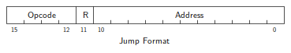
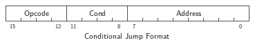
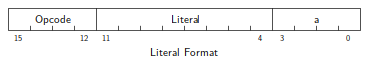
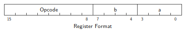

# 5 Micro Instructions

## 5.1 Instruction Repertoire

This section contains descriptions of the microinstructions. With each
description is a diagram showing the format of the instruction and its
operation code, given in hexadecimal. Above each diagram is the instruction
mnemonic operation code, the argument needed by the assembler, and the name
of the instruction.

Under each diagram is a description of the command and its timing in clock
cycles. It should be noted that the descriptions of the instructions are
rather perfunctory. For a more thorough description of the instructions from
a programmer's standpoint, the user is invited to review the “MCP1600 Micro
Programmer's Manual”.

The purpose of this section then is to outline the structure of the
instruction set as an aid to understanding the events on the two processor
busses.

While the formats presented here describe 16 bits of the instruction word, be
aware that the word is, in fact, 22 bits wide. The portion of the instruction
described here control the operation of the processor. The other 6 bits are:

* Bits 16 and 17 are involved with control of the Location Counter (LC):

  * bit 16 determines whether or not the contents of the Return Register (RR)
    will be loaded into the LC;
  * bit 17 determines whether or not a Read Next Instruction (RNI)
    translation will be invoked.

  These two options are available on all instructions.

* Bits 18 through 21 have nothing to do with control of the MCP1600 system.
  They are available for the user to program as TTL levels. These bits are
  available on all instructions.

## 5.2 Instruction Types

All of the MCP1600 microinstructions are 22 bits long. Of the 22 bits, the 16
least significant effect the operation of the CPU. The purposes of the other
6 bits are covered in either the Programmed Translation Array (PTA)
description or the Micro Instruction Bus (MIB) description.

The instructions for the MCP1600 are divided into four classes as follows:

### 5.2.1 Jump Format

This format provides an 11-bit Control ROM address. It causes an
unconditional jump to any location in the permissable MICROM address space by
always asserting the jump control line (JXX on the Data Chip or MIB15 on the
Micro Instruction Bus). The unconditional jump instruction is the only one
that utilizes this format.

Unconditional jump instructions always take two clock cycles; one to decode
the instruction, the second to load the Location Counter (LC) on the Control
Chip.

A special case of this format is the Return From Subroutine (RFS)
instruction, covered later.

### 5.2.2 Conditional Jump Format

This format provides a Jump address within a page. This instruction is
substantially the same as the Unconditional Jump format, with exception of
the reduced address space. It is also a two cycle instruction, with the jump
decision (based upon the contents of the *C* Field) being made by the jump
decode logic on the Data Chip during the first cycle. This decision is
communicated to the Control Chip via MIB15 (JXX on the Data Chip). During the
second cycle the jump is affected.

### 5.2.3 Literal Format

This format provides 8-bit literal data. The *a* field usually specifies a
file register. These instructions invoke the ‘literal path’ to fetch data
around the register file for the B input to the ALU. All of these
instructions execute in one clock cycle.

### 5.2.4 Register Format

This format is by far the predominant one. In it, *b* and *a* are register
file designators. Generally, depending upon the operation, there can be two
meanings to the register designators:

op (*b*) → *a*

as, for instance, in a shift or move instruction;

op (*b*, *a*) → *a*

as, for instance, in an arithmetic instruction.

*b* and *a* can specify either a single byte data quantum or a word (double
byte) data quantum. In this latter case, the designators usually point to the
even addressed member of a register pair. While they may both point to an odd
addressed pair, note carefully the instructions description for the effect.

If the designators apply to a word data quantum, the instruction takes two
cycles to execute. The following sections describe MCP1600 instructions by
classes of function.

## 5.3 MCP1600 Micro-Instruction Set

The following micro-instructions are contained in the MCP1600. The symbology
used is listed in the table below.

| Symbols      | Meaning                                                    |
| ------------ | ---------------------------------------------------------- |
| →            | is transferred to                                          |
| ( )          | contents of location or register                           |
| ∧            | Logic Product (AND)                                        |
| ∨            | Inclusive OR                                               |
| ⊻            | Exclusive OR                                               |
| Rx:Ry        | Forms extended register: Ry — LSB, Rx — MSB                |
| Ra           | The register specified by the micro-instruction *a* field  |
| Rb           | The register specified by the micro-instruction *b* field  |
| Flag Setting | Designates no category                                     |
| x            | Don't care condition                                       |
| 0            | Flag cleared (set to 0)                                    |
| 1            | Flag set                                                   |
| -            | Flag not affected                                          |
| *            | Set according to function (see flag description in Section 5.3.2) |

TBD ...

