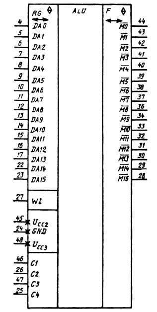

# К581ИК1, К581ИК1А, КР581ИК1, КР581ИК1А

Микросхемы представляют собой регистровое арифметике-логическое устройство
обработки данных. В состав ИС входят АЛУ, регистры общего назначения (РОН),
дешифратор, регистр микрокоманд, регистр-указатель для адресации к РОН;
устройство местного управления с логической матрицей дешифрации кода
микрокоманды и буферные схемы. Содержат 6000 интегральных элементов. Корпус
типа 244.48-1 и 413.48-5, масса не более 6 г.

Функциональный аналог Western Digital CP1611 (RALU — Register ALU chip, Data
chip).

Условное графическое обозначение К581ИК1, КР581ИК1

## Назначение выводов

*  1..3  — свободные;
*  4..17 — входы/выходы 0..13 разрядов системного канала (DA0..DA13);
* 18..21 — свободные;
* 22..23 — входы/выходы 14..15 разрядов системного канала (DA14..DA15);
* 24     — общий (GND, VSS);
* 25     — вход тактового импульса C4;
* 26     — вход тактового импульса C2;
* 27     — вход «ожидать» (WI, WAIT), перевод ИК1 в режим ожидания (сигнал от ИК2);
* 28..34 — разряды 15..9 микроканала (!M15..M9);
* 35     — свободный;
* 36..44 — разряды 8..0 микроканала (!M8..M0);
* 45     — напряжение питания UП2 (VDD, +12V), UП1;
* 46     — вход тактового импульса C1;
* 47     — вход тактового импульса C3;
* 48     — напряжение питания -UП3 (VBB, -5V).

Замечания:

* Шина DA0..DA15 — push-pull с high-Z, активный уровень — высокий.
* Шина M0..M15   — push-pull с high-Z, активный уровень — низкий.

## Электрические параметры

<pre>
Номинальное напряжение питания
  - UП2 ....................................................... 12 В ± 5%
  - UП3 ....................................................... -5 В ± 5%
Контроль выходных уровней напряжения .......................... ≤ 0,5 В
Выходное напряжение низкого уровня ............................ ≤ 0,6 В
Выходное напряжение высокого уровня ........................... ≥ 2,3 В
Ток потребления:
  - от источника питания UП2 .................................. ≤ 35 мА
  - от источника питания UП3 .................................. ≤  1 мА
Ток утечки на входах .......................................... ≤ 1,2 мкА
Ток утечки на тактовом входе .................................. ≤ 100 мкА
Ток утечки на выходе .......................................... ≤ 1,2 мкА
Потребляемая мощность ......................................... ≤ 0,514 Вт
Проверка функциональной годности (времени цикла микрокоманды):
  - КР581ИК1, К581ИК1 ......................................... ≤ 440 нс
  - КР581ИК1А, К581ИК1А ....................................... ≤ 600 нс
Входная емкость ............................................... ≤ 14 пФ
Входная емкость по тактовым входам ............................ ≤ 80 пФ
</pre>

## Предельно допустимые режимы эксплуатации

<pre>
Напряжение питания:
  - максимальное UП2 .......................................... 12,6 В
  - минимальное UП3 ........................................... -6,3 В
Максимальное входное напряжение
высокого уровня по тактовым входам ............................ 12,6 В
Время цикла микрокоманды:
  - КР581ИК1, К581ИК1 ......................................... 440...2800 нс
  - КР581ИК1А, К581ИК1А ....................................... 600...2800 нс
Температура окружающей среды .................................. -10...+70 °C
</pre>

