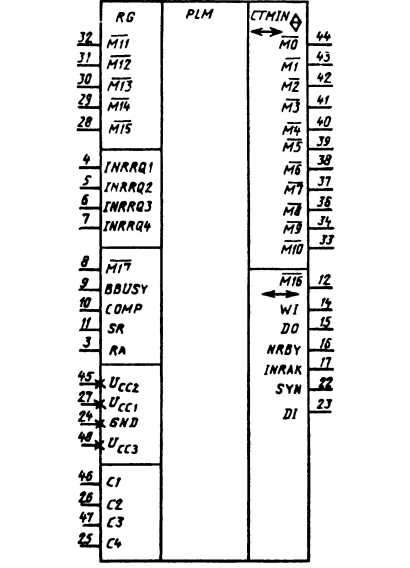

# К581ИК2, К581ИК2А, КР581ИК2, КР581ИК2А

Микросхемы представляют собой схему управления выполнением
операции. Предназначены для генерации адресов микропоследовательностей
для микропрограммного ПЗУ и управляющих сигналов для внешних операций
ввода/вывода. В состав ИС входят регистры системных команд и микрокоманд,
программируемая матрица трансляции, счетчик микрокоманд, регистры
возврата и состояния, схемы управления. Содержат 4000 интегральных
элементов. Корпус типа 244.48-1 и 413.48-5, масса не более 6 г.

Функциональный аналог Western Digital CP1621 (CON — CONtrol chip).

Условное графическое обозначение К581ИК2, КР581ИК2

## Назначение выводов

*  1..3  — свободные;
*  4     — вход «прерывание от внешнего устройства» (IRQ1);
*  5     — вход «прерывание по таймеру» (IRQ2, EVNT);
*  6     — вход «прерывание по питанию» (IRQ3, ACLO);
*  7     — вход «прерывание по регенерации ОЗУ» (IRQ4, VIRQ);
*  8     — вход 17 разряда микроканала (!RNI, !M17);
*  9     — вход «канал занят» (BUSY);
* 10     — вход «дополнение» (COMP, COMPUTE), используется при отладке;
* 11     — вход «сброс» (!SR), начальная установка адреса микрокоманды;
* 12     — вход/выход 16 разряда микроканала (!SRA, !M16);
* 13     — вход «готово» (RA, REPLY), данные установлены в канале или приняты;
* 14     — выход «ожидать» (WI, WAIT), перевод ИК1 в режим ожидания;
* 15     — выход «вывод данных» (DOUT);
* 16     — выход «запись байта» (WB);
* 17     — выход «подтверждение прерывания» (IACK);
* 18..21 — свободные;
* 22     — выход «синхро» (SYNC);
* 23     — выход «ввод данных» (DIN);
* 24     — общий (GND, VSS);
* 25     — вход тактового импульса C4;
* 26     — вход тактового импульса C2;
* 27     — напряжение питания UП1 (VCC, +5V);
* 28..32 — входы 15..11 разрядов микроканала (!M15..M11);
* 33..34 — входы/выходы 10..9 разрядов микроканала (!M10..M9);
* 35     — свободный;
* 36..44 — входы/выходы 8..0 разрядов микроканала (!M8..M0);
* 45     — напряжение питания UП2 (VDD, +12V), UП1;
* 46     — вход тактового импульса C1;
* 47     — вход тактового импульса C3;
* 48     — напряжение питания -UП3 (VBB, -5V).

Замечания:

* Шина DA0..DA15 — push-pull с high-Z, активный уровень — высокий.
* Шина M0..M15   — push-pull с high-Z, активный уровень — низкий.
* SRA — Store Return Address to Return Register (RR)

## Электрические параметры

<pre>
Номинальное напряжение питания
  — UП1 .......................................................  5 В ± 5%
  — UП2 ....................................................... 12 В ± 5%
  — UП3 ....................................................... -5 В ± 5%
Выходное напряжение низкого уровня ............................ ≤ 0,7 В
Выходное напряжение высокого уровня ........................... ≥ 3,4 В
Ток потребления:
  — от источника питания UП1 .................................. ≤ 8 мА
  — от источника питания UП2 .................................. ≤ 25 мА
  — от источника питания UП3 .................................. ≤  1 мА
Ток утечки на входах .......................................... ≤ 1,2 мкА
Ток утечки на тактовом входе .................................. ≤ 100 мкА
Ток утечки на выходе .......................................... ≤ 1,2 мкА
Потребляемая мощность ......................................... ≤ 0,39 Вт
Проверка функциональной годности (времени цикла микрокоманды):
  — КР581ИК2, К581ИК2 ......................................... ≤ 440 нс
  — КР581ИК2А, К581ИК2А ....................................... ≤ 600 нс
Входная емкость ............................................... ≤ 10 пФ
Входная емкость по тактовым входам ............................ ≤ 80 пФ
</pre>

## Предельно допустимые режимы эксплуатации

<pre>
Напряжение питания:
  — максимальное UП1 .......................................... 5,25 В
  — максимальное UП2 .......................................... 12,6 В
  — минимальное UП3 ........................................... -6,3 В
Максимальное входное напряжение
высокого уровня по тактовым входам ............................ 12,6 В
Время цикла микрокоманды:
  — КР581ИК2, К581ИК2 ......................................... 440...2800 нс
  — КР581ИК2А, К581ИК2А ....................................... 600...2800 нс
Температура окружающей среды .................................. -10...+70 °C
</pre>

