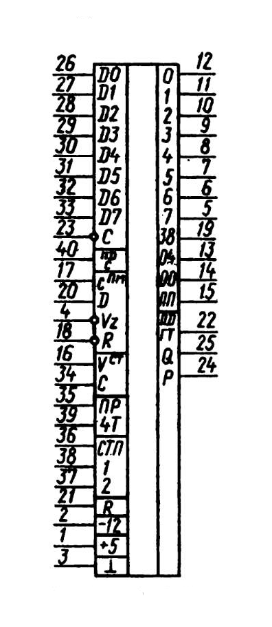

# КР581ВА1А, КР581ВА1Б

Микросхемы представляют собой универсальный асинхронный приемопередатчик
цифровой информации в двоичном коде 5, 6, 7 или 8 бит. Предназначены для
использования в мультиплексорах, концентраторах, построчно-печатающих
устройствах, индикаторах на ЭЛТ, связи асинхронного последовательного канала
данных устройств или терминалах с параллельным каналом ЭВМ, а также в других
устройствах, предназначенных для преобразования асинхронно передаваемых
данных из параллельного формата в последовательный и наоборот.

## Функциональные параметры

* Автоматическая внутренняя синхронизация, автоматическая генерация
  стартового, контрольного (по четности) и стоповых бит.
* Возможность программирования: длины передаваемого слова (5, 6, 7 и 8 бит),
  числа стоповых бит (1..2), запрета и генерации бита четности.
* Автоматическая генерация признаков состояния:
  1. для передатчика: начало передачи — стартовый бит, конец передачи —
     стоповый бит, готовность к передаче TE, запрос приема данных — TR;
  2. для приемника: запрос данных — !CTS = RD, ошибка четности — PE, ошибка
     формата (обмена) — FE, переполнение данными — OE.

По входам и выходам согласуются со схемами ТТЛ. Содержат 1100 интегральных
элементов. Корпус типа 2123.40-1, масса не более 8 г.

## Назначение выводов

*  1     — напряжение питания UП1 (VCC, +5V);
*  2     — нaпряжение питания UП2 (VBB, -12V);
*  3     — общий (GND, VSS);
*  4     — вход «буферный регистр приемника отключен» (!ROE — RD Output Enable);
*  5..12 — выходы данных приемника (RD0..RD7);
* 13     — выход «ошибка четности» (PE — Parity Error);
* 14     — выход «ошибка обмена данными» (FE — Frame Error);
* 15     — выход «переполнение» (OE — Overrun Error);
* 16     — вход «флаг состояния отключено» (!SOE — Status Output Enable);
* 17     — вход импульсов тактовых сигналов приемника (RCK);
* 18     — вход «сброс флага приема» (!RE — Read Enable);
* 19     — выход «прием данных» (RD — Receiver Done);
* 20     — вход приемника (RX);
* 21     — вход «сброс» (RESET);
* 22     — выход «буферный регистр передатчика очищен» (TBE):
* 23     — вход «загрузка буферного регистра передатчика» (!TWE — TD Write Enable);
* 24     — выход «регистр данных передатчика очищен» (TD — Transmitter Done);
* 25     — выход передатчика (TX);
* 26..33 — входы передатчика (TD0..TD7);
* 34     — вход «загрузка регистра управления» (CLE — Constrol Latch Enable);
* 35     — вход «запрет четности» (PI — Parity Inhibit);
* 36     — вход «выбор стоповых битов» (SBS — Stop Bit Select — 0 или 1.5..2);
* 37..38 — входы «выбор длины слова» (WLS1..WLS0 — World Lengt 5..8);
* 39     — вход «установка четности» (EPE — Even Parity Enable);
* 40     — вход импульсов тактовых сигналов передатчика (TCK).

Замечания:

* Низкий активный уровень !ROE разрешает вывод RD0..RD7..
* Низкий активный уровень !SOE разрешает вывод PE, FE, OE, RD and TR.
* DL11 Transmitter Ready: TR = RTS & TBE
* CTS = !RD

## Электрические параметры

<pre>
Номинальное напряжение питания
  - UП1 ....................................................... 5 В ± 5%
  - UП2 ....................................................... -12 В ± 5%
Входное напряжение низкого уровня
  - при I⁰вх = 1,6 мА ......................................... 0,4 В
Входное напряжение высокого уровня
  - при I¹вх = 0,05 мА ........................................ 5,25 В
Ток потребления от источника питания UП1 ...................... ≤ 60 мА
Ток потребления от источника питания UП2 ...................... ≤ 24 мА
Входной ток утечки ............................................ ≤ 50 мкА
Входной ток низкого уровня .................................... ≤ 1,6 мА
Выходной ток в состоянии «выключено» .......................... ≤ 5 мА
Частота следования импульсов тактовых сигналов
(при U¹вх = 3,75 В, U⁰вых = 0,5 В):
  - КР581ВА1А ................................................. 0,8..480 кГц
  - КР581ВА1Б ................................................. 0,8..192 кГц
Период следования импульсов тактовых сигналов:
  - КР581ВА1А ................................................. ≥ 2000 нс
  - КР581ВА1Б ................................................. ≥ 5000 нс
Скорость приемопередачи информации:
  - КР581ВА1А ................................................. ≤ 30000 бит/с
  - КР581ВА1Б ................................................. ≤ 12000 бит/с
</pre>

## Предельно допустимые режимы эксплуатации

<pre>
Напряжение питания:
  - UП1 ....................................................... 4,75..5,25 В
  - UП2 ....................................................... -11,4..-12,6 В
Входное напряжение низкого уровня ............................. -0,3..+0,8 В
Ёмкость нагрузки .............................................. ≤ 160 пФ
Температура окружающей среды .................................. -10..+70 °С
</pre>

## Рекомендации по применению

Монтаж ИС проводить только в обесточенном состоянии. Допустимое значение
статического потенциала 30 В. Не рекомендуется брать ИС руками, а только
пинцетом или рукой с браслетом, заземленным через сопротивление 1 МОм. При
хранении выводы ИС должны быть закорочены. Максимальная температура пайки
(+270 ± 10) °С, продолжительность пайки не более 3 с, мощность паяльника не
более 25 Вт.

