# 4 Микропроцессорный комплект серии KP581

Микропроцессорный комплект (МПК) серии КР581 предназначен для построения
микро-ЭВМ типа «Электроника-60», программно совместимой с мини-ЭВМ семейства
СМ ЭВМ.

Область применения: управление производством и технологическими процессами,
сбор и обработка данных, решение научно-технических и
экономико-статистических задач, проведение инженерно-конструкторских
расчетов, моделирование и управление объектами в реальном масштабе времени.

Микропроцессорный комплект n-канальных МДП микросхем представляет собой
16-разрядный микропроцессор с микропрограммным управлением и включает в себя
микросхемы шести типов (табл. 4.1):

: Таблица 4.1. Состав микропроцессорного комплекта

| Тип микросхемы | Функциональное назначенне                     | Тип корпуса |
| -------------- | --------------------------------------------- | ----------- |
| КР581ИК1*      | Обработка информации                          | 413.48-5    |
| КР581ИК2*      | Управление выполнением операций               | 413.48-5    |
| КР581РУ1*      | Микропрограммное запоминающее устройство для реализации стандартного набора системы команд | 413.48-5 |
| КР581РУ2*      | Хранение микрокоманд управления выполнением операций | 413.48-5 |
| КР581РУ3*      | Микропрограммное запоминающее устройство для реализации операций с плавающей запятой | 413.48-5 |
| КР581ВЕ1       | Микропроцессор с микропрограммным управлением | 413.48-5 |

Примечания:

* Микросхемы, отмеченные звёздочкой, составляют базовый МПК серии КР581.
* Микросхема КР581ВЕ1 по функциям аналогична базовому МПК серии КР581.

Микросхемы серии KP581 собой функционально представляют законченные узлы и
блоки микропроцессора.

: Общие характеристики МПК

```
Разрядность обрабатываемых данных ......................... 8, 16 бит
Управление ................................................ Микропрограммное
Число типов команд, включая команды с плавающей запятой ... 72
Объем адресуемой памяти ................................... 64К байт
Число способов адресации .................................. 8
Число уровней прерывания .................................. 4
Шина адреса и данных ...................................... Совмещенная
Быстродействие ............................................ 250 тыс. операций/с
Система команд ............................................ Типа «Электроника-60»
```

Для всех типов ИС МПК серии К581 статические параметры приведены в табл. 4.2,
динамические — в табл. 4.3.

: Таблица 4.2. Статические параметры

| Параметр                                                 | Обозначение     | мин.  | макс. |
| -------------------------------------------------------- | --------------- | ----- | ----- |
| Напряжение питания, В                                    | U<sub>CC1</sub> |  4,75 |  5,25 |
|                                                          | U<sub>CC2</sub> |  11,4 |  12,6 |
|                                                          | U<sub>CC3</sub> | -5.25 | -4.75 |
| Ток утечки входов, мкА                                   | I<sub>LIO</sub> | —     |  1,2* |
| Ток утечки тактовых входов, мкА                          | I<sub>LIC</sub> | —     |  20*  |
| Входное напряжение высокого уровня по тактовым входам, В | U<sub>IHC</sub> |  11,4 |  12,6 |
| Входное напряжение низкого уровня по тактовым входам, В  | U<sub>ILC</sub> | -0,5  | +0,5  |
| Ёмкость тактовых входов, пФ                              | C<sub>C</sub>   | —     |  80*  |

\* При T = +25°C.

: Таблица 4.3. Динамические параметры

| Параметр | Обозначение | КР581 мин. | макс. | КР581-А мин. | макс. | КР581ВЕ1 мин. | макс. |
| -------- | ----------- | ---------- | ----- | ------------ | ----- | ------------- | ----- |
| Длительность тактового цикла, нс             | t<sub>C</sub> | 400 | — | 600 | — | 300 | — |
| Длительность тактового сигнала, нс           | τ<sub>C</sub> |  90 | — | 125 | — |  70 | — |
| Время задержки между тактовыми сигналами, нс | t<sub>D</sub> |  20 | — |  20 | — |   5 | — |
| Время перехода тактового сигнала при включении и выключении, нс | t<sub>THLC</sub>, t<sub>TLHC</sub> | 10 | 50 | 10 | 50 | — | 20 |
| Время перехода входных сигналов при включении и выключении, нс  | t<sub>THL</sub>, t<sub>TLH</sub>   |  5 | 50 |  5 | 50 | — | 10 |

## 4.1 Микросхема КР5З1ИК1

Микросхема КР581ИК1 предназначена для выполнения логических и арифметических
функций над системными данными.

Условное графическое обозначение КР581ИК1 приведено на рис. 4.1, структурная
схема дана на рис. 4.2, функциональное назначение выводов — в табл. 4.4,
временная диграмма показана на риз. 4.3.

### 4.1.1 Условное графическое обозначение


: Рис. 4.1. Условное графическое обозначение КР581ИК1

### 4.1.2 Функциональное назначение выводов

: Таблица 4.4. Функциональное назначение выводов КР581ИК1

| Вывод          | Обозначение     | Тип вывода | Функциональное назначение выводов |
| -------------- | --------------- | ---------- | --------------------------------- |
| 4—17, 22, 23   | DA0 — DA15      | Вход/выход | Шина адреса и данных. Используется мультиплексный режим работы информационных шин (передача адресных сигналов, команд и данных по одной шиие) |
| 28—34          | !M15 — !M0      | Вход/выход | Шина микрокоманд. По шине микрокоманд организован обмен информацией между всеми микросхемами комплекта |
| 27             | WI              | Вход       | Сигнал «Ожидание». При поступлении данного сигнала микросхема переходит в режим ожидания |
| 46, 26, 47, 25 | C1 — C4         | Входы      | Тактовые сигналы от внешнего генератора |
| 45             | U<sub>CC2</sub> | —          | Напряжение питания +12 B |
|                | U<sub>CC1</sub> | —          | Напряжение питания +5 B  |
| 48             | U<sub>CC3</sub> | —          | Напряжение питания -5 B  |
| 24             | GND             | —          | Общий                    |

Примечания:

* Источник питания U<sub>CC1</sub> не используется.

### 4.1.3 Структурная схема

Функционально микросхема включает в себя:

* арифметико-логическое устройство (АЛУ);
* регистры общего назначения (РОН);
* дешифратор;
* регистр микрокоманд и регистр-указатель для адресации к РОН;
* устройство местного управления, содержащее логическую матрицу дешифрации
  кода микрокоманды;
* буферные схемы.

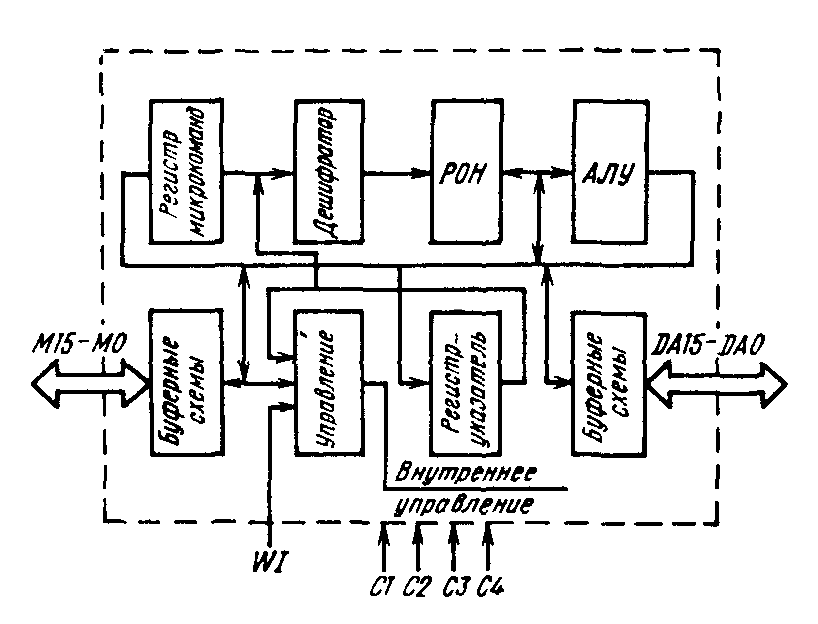

: Рис. 4.2. Структурная схема КР581ИК1

Выполнение всех операций осуществляется под управлением соответствующих
микрокоманд (табл. 4.5). Система микрокоманд, реализуемая КР581ИК1, является
важнейшей характеристикой МПК, достаточно универсальна и позволяет
эмулировать произвольный набор системных команд. Для обеспечения возможности
расширения системы команд или ее модификации и реализации всех преимуществ
микропрограммного способа управления шина микрокоманд (ШМК) выполнена внешней
по отношению к микросхемам МПК.

### 4.1.4 Временная диаграмма работы

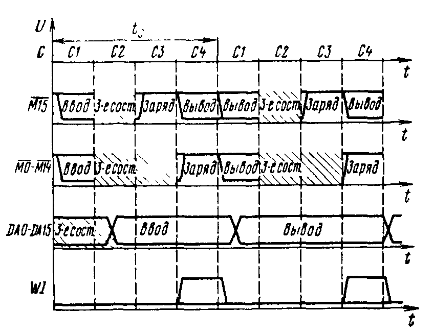

: Рис. 4.3. Временная диаграмма работы КР581ИК1

### 4.1.5 Список микрокоманд

Набор микрокоманд (табл. 4.5), реализуемых микросхемой, состоит из следующих
групп микрокоманд в соответствии с выполняемыми функциями: арифметические,
логические, регистровые, сдвига, ввода, вывода, перехода,
инкремента-декремента, управления.

: Таблица 4.5. Список микрокоманд КР581ИК1

| Группы микрокоманд | Операция                                         | Число циклов | Примечание |
| ------------------ | ------------------------------------------------ | ------------ | ---------- |
| Арифметические     | Сложение литералов                               | 1 | R<sub>a</sub> ← R<sub>a</sub> + ЛИТ |
|                    | Сложение байтов                                  | 1 | R<sub>a</sub> ← R<sub>a</sub> + R<sub>b</sub> |
|                    | Сложение слов                                    | 2 | R<sub>a</sub> ← R<sub>a</sub> + R<sub>b</sub> |
|                    | Условное сложение байтов                         | 1 | — |
|                    | Условное сложение слов                           | 2 | — |
|                    | Сложение байтов с переносом                      | 1 | R<sub>a</sub> ← R<sub>a</sub> + R<sub>b</sub> + C |
|                    | Сложение слов с переносом                        | 2 | R<sub>a</sub> ← R<sub>a</sub> + R<sub>b</sub> + C |
|                    | Условное сложение слов                           | 2 | — |
|                    | Условное сложение чисел                          | 1 | — |
|                    | Вычитание байта                                  | 1 | R<sub>a</sub> ← R<sub>a</sub> - R<sub>b</sub> |
|                    | Вычитание слова                                  | 2 | R<sub>a</sub> ← R<sub>a</sub> - R<sub>b</sub> |
|                    | Вычитание байтов с переносом                     | 1 | R<sub>a</sub> ← R<sub>a</sub> - R<sub>b</sub> - C |
|                    | Вычитание слов с переносом                       | 2 | R<sub>a</sub> ← R<sub>a</sub> - R<sub>b</sub> - C |
| Логические         | Логическое умножение литералов                   | 1 | R<sub>a</sub> ← R<sub>a</sub> ∧ ЛИТ |
|                    | Логическое умножение байтов                      | 1 | R<sub>a</sub> ← R<sub>a</sub> ∧ R<sub>b</sub> |
|                    | Логическое умножение слов                        | 2 | R<sub>a</sub> ← R<sub>a</sub> ∧ R<sub>b</sub> |
|                    | Логнческое сложение байтов                       | 1 | R<sub>a</sub> ← R<sub>a</sub> ∨ R<sub>b</sub> |
|                    | Логическое сложение слов                         | 2 | R<sub>a</sub> ← R<sub>a</sub> ∨ R<sub>b</sub> |
|                    | Исключающее ИЛИ байтов                           | 1 | R<sub>a</sub> ← R<sub>a</sub> ⊻ R<sub>b</sub> |
|                    | Исключающее ИЛИ слов                             | 2 | R<sub>a</sub> ← R<sub>a</sub> ⊻ R<sub>b</sub> |
|                    | Логическое умножение прямого и инверсного байтов | 1 | R<sub>a</sub> ← R<sub>a</sub> ∧ !R<sub>b</sub> |
|                    | Логическое умножение прямого и инверсного слов   | 2 | R<sub>a</sub> ← R<sub>a</sub> ∧ !R<sub>b</sub> |
|                    | Копирование «флагов»                             | 1 | — |
|                    | Загрузка «флагов»                                | 1 | — |
| Регистровые        | Загрузка регистра-указателя                      | 1 |  |
|                    | Пересылка байта                                  | 1 | R<sub>a</sub> ← R<sub>b</sub> |
|                    | Пересылка слова                                  | 2 | R<sub>a</sub> ← R<sub>b</sub> |
|                    | Условная пересылка байта                         | 1 | — |
|                    | Условная пересылка слова                         | 2 | — |
|                    | Загрузка регистра команд                         | 2 | — |
|                    | Сравнение литерала                               | 1 | — |
|                    | Проверка литерала                                | 1 | — |
|                    | Дополнение байта прямое                          | 1 | — |
|                    | Дополнение слова прямое                          | 2 | — |
|                    | Дополнение байта инверсное                       | 1 | — |
|                    | Дополнение слова инверсное                       | 2 | — |
|                    | Сравнение байта                                  | 1 | — |
|                    | Сравнение слова                                  | 2 | — |
|                    | Проверка байта                                   | 1 | — |
|                    | Проверка слова                                   | 2 | — |
|                    | Вывод слова состояния                            | 1 | — |
| Сдвига             | Сдвиг байта влево с переиосом                    | 1 | R<sub>a</sub> ← 2R<sub>b</sub> + C |
|                    | Сдвиг слова влево с переносом                    | 2 | R<sub>a</sub> ← 2R<sub>b</sub> + C |
|                    | Сдвиг байта влево                                | 1 | R<sub>a</sub> ← 2R<sub>b</sub> |
|                    | Сдвиг слова влево                                | 2 | R<sub>a</sub> ← 2R<sub>b</sub> |
|                    | Сдвиг байта вправо с переносом                   | 1 | — |
|                    | Сдвиг слова вправо с переносом                   | 2 | — |
|                    | Сдвиг байта вправо                               | 1 | — |
|                    | Сдвиг слова вправо                               | 2 | — |
| Перехода           | Переход                                          | 2 | 5 типов |
|                    | Возврат к подпрограмме                           | 2 | 8 типов |
|                    | Условный переход                                 | 2 | 5 типов |
| Ввода, вывода      | Ввод литерала                                    | 1 | — |
|                    | Ввод байта                                       | 1 | — |
|                    | Ввод слова                                       | 2 | — |
|                    | Ввод байта состояния                             | 1 | — |
|                    | Ввод слова состояния                             | 2 | — |
|                    | Чтение и увеличение байта на 1                   | 1 | ШАД ← R<sub>b</sub>, R<sub>a</sub>;<br>R<sub>a</sub> ← R<sub>a</sub> + 1 |
|                    | Чтение и увеличение слова на 1                   | 2 | — |
|                    | Чтение и увеличение байта на 2                   | 1 | — |
|                    | Чтение и увеличение слова на 2                   | 2 | — |
|                    | Чтение (запись)                                  | 1 | ШАД ← R<sub>b</sub>, R<sub>a</sub> |
|                    | Вывод байтов                                     | 1 | ШАД ← R<sub>b</sub>, R<sub>a</sub> |
|                    | Вывод слов                                       | 1 | ШАД ← R<sub>b</sub>, R<sub>a</sub> |
| Инкремента, декремента | Условное приращение байта                    | 1 | R<sub>a</sub> ← R<sub>a</sub> + 1  |
|                        | Условиое уменьшение байта                    | 1 | R<sub>a</sub> ← R<sub>a</sub> - 1  |
|                    | Наращивание байта на 1                           | 1 | R<sub>a</sub> ← R<sub>a</sub> + 1  |
|                    | Наращивание слова на 1                           | 2 | — |
|                    | Наращивание байтa на 2                           | 1 | R<sub>a</sub> ← R<sub>a</sub> + 2  |
|                    | Наращиванне словa нa 2                           | 2 | — |
|                    | Уменьшение байта на 1                            | 1 | R<sub>a</sub> ← R<sub>a</sub> - 1  |
|                    | Уменьшение слова на 1                            | 2 | — |
| Управления         | Сброс прерывания                                 | 1 | — |
|                    | Установка прерывания                             | 1 | — |
|                    | Сброс регистра состояния                         | 1 | — |
|                    | Нет операции                                     | 1 | — |

Примечания:

1. R<sub>a</sub> — регистр с адресом noля *a* микрокоманды; R<sub>b</sub> —
   регистр с адресом поля *b* микрокоманды; ЛИТ — литерал; ШАД — шина адреса
   и данных.
2. Общее число реализуемых микрокоманд 91.

### 4.1.6 Описание работы

Под временем цикла t<sub>C</sub> на временных диаграммах понимается
промежуток времени между началом действия тактового сигнала C1 первого цикла
и началом действия тактового сигнала C1 второго цикла.

Обозначение выводов микросхем на диаграммах принято в соответствии с
условными графическими обозначениями и табл. 4.4.

На рис 4.3 приняты следующие обозначения:

* Ввод — ввод информации по данному выводу или группе выводов во время
  действия соответствующих тактовых сигиалов;
* Вывод — вывод информации по данному выводу или группе выводов;
* Заряд — установление на данном выводе или группе выводов напряжения
  высокого уровня;
* 3-е сост. — во время действия соответствующих тактовых сигналов на данном
  выводе (группе выводов) устанавливается режим 3-го состояния.

Эти обозначения приняты для выводов с совмещенными функциями ввода/вывода
информации. Для выводов, выполняющих функции только входов или только
выходов, такие обозначения не приведены. Функцию заряда разрядов ШМК в МПК
выполняют микросхемы КР581РУ1 — КР581РУЗ.

Блок РОН имеет двухканальную (двухпортовую) структуру; при этом один из
каналов (порт B) предназначен только для чтения, а второй (порт A)
используется как для чтения, так и для записи информации. Порт A регистрового
блока связан с шиной адреса и данных ШАД, через эту шину осуществляется
передача данных, хранящихся в регистровом блоке, внешним схемам.

Информация, подлежащая обработке, поступает в АЛУ по шинам порта A и порта B
блока РОН. АЛУ производит операцию и результат записывается в регистр по
адресу порта А.

При обращении к регистровому блоку адрес регистров по порту A и порту B
выбирается из адресного поля текущей микрокоманды. Поле микрокоманды разрядов
3..0 (поле *a*) служит адресом регистра порта A блока РОН, а поле
микрокоманды разрядов 7..4 (поле *b*) служит адресом регистра порта B блока
РОН для двухадресных микрокоманд. В случае одноадресной микрокоманды
обращение осуществляется только по адресу поля *a* микрокоманды.

При микрокомандах перехода код операции содержится в разрядах 15..12
микрокоманды, в оставшихся разрядах 11..0 заключен адрес. В микрокомандах
условного перехода код операции содержится в разрядах 15..12 микрокоманды,
условие — в разрядах 11..8, а адрес в разрядах 7..0 микрокоманды.

Тактовые сигналы C1—C4 представляют собой серию из четырех следующих друг за
другом неперекрывающихся во времени импульсов напряжения (рис. 4.3).

Микрокоманда, подлежащая исполнению, поступает в блок управления, содержащий
программируемую логическую матрицу расшифровки кода микрооперации. Блок
управления вырабатывает управляющне сигналы, задающие АЛУ режим работы,
соответствующий поданной микрокоманде. АЛУ пapaллельно обрабатывает два
операнда.

Обработка 16-разрядных слов осуществляется за два цикла под управлеинем
двухцикловых микрокоманд. Обработка 8-разрядных слов требует одного цикла и
реализуется одноцикловыми микрокомандами.

При регистровых микрокомандах код операции, поступающий на расшифровку в блок
управления, содержится в разрядах 15..8 микрокомаиды, а поля *a* и *b*
микрокоманды содержат адреса регистров общего назначения, содержимое которых
подвергается обработке. Запись результата обработки производится в РОН по
адресу поля *a* микрокоманды.

При литеральных микрокомандах в качестве одного из операндов в операциях АЛУ
используется литеральная часть микрокоманды. Код операции содержится в
разрядах 15..12 микрокоманды, второй операнд заключен в РОН с адресом поля
*a* (3..0), а код литерала — в разрядах 11..4 микрокоманды. Результат
обработки информации поступает в РОН, имеющий адрес поля *a* микрокоманлы.

При микрокомандах условного перехода осуществляется проверка состояния
флага условия, определяемого разрядами 11..8 микрокоманды. Результат
проверки выдается в следующем цикле (адрес в разрядах 7..0).

Во время двухцикловых микрокоманд во втором цикле регистр микрокоманд
воспроизводит поданную в первом цикле микрокоманду с инвертированными
младшими разрядами полей *a* и *b* микрокоманды. Этим обеспечивается
последовательная обработка 16-разрядных данных 8-разрядным АЛУ с помощью
одной микрокоманды.

Выбор нужных РОН осуществляется адресным дешифратором.

Построение блока РОН обеспечивает:

* параллельную выдачу АЛУ содержимого двух 8-разрядных РОН (двух операндов);
* вывод в ШАД и ШМК 16-разрядных слов.

Блок РОН состоит из 26 8-разрядных регистров:

* 10 регистров могут прямо адресоваться микрокомандами;
* 4 адресуются прямо и косвенно (эти регистры выполняют специальные функции
  процессора — счетчик команд, указатель стека);
* 12 регистров имеют только косвенную адресацию и используются в качестве
  регистров общего назначения.

В РОН с адресом поля *a* микрокоманды может записываться следующая
информация:

* результат обработки информации АЛУ;
* младший байт слова, поступающего в ШАД;
* старший байт слова, поступающего в ШАД;
* содержимое флагов условий;
* литеральная часть микрокоманды.

В ШАД в режиме ввода информации поступают команды и данные, которые заносятся
в нужные РОН и могут передаваться в ШМК. В режиме вывода информации в ШАД
выводится 16-разрядное слово — содержимое РОН, адрес которых определяется
полями *a* и *b* микрокоманды.

В ШМК может выводиться:

* информация, поданная в ШАД;
* результат проверки флагов условий;
* 16-разрядное слово — содержимое РОН, адрес которых определяется полями *a*
  и *b* микрокоманды.

Регистр-указатель для косвенной адресации представляет собой трехразрядный
регистр, храняший адрес пары РОН: он может загружаться либо из адресной части
системной команды, либо из адресного поля регистра системной команды.

Регистры кодов условий обеспечивают хранение следующих условий:

* отрицательный результат;
* нулевой результат;
* 4-разрядный перенос;
* 8-разрядный перенос;
* переполнение.

Схема проверки состояия флагов условий обеспечивает выдачу результата
проверки при подаче микрокоманд условного перехода.

При поступлении на вход WI сигнала «Ожидать» регистр микрокоманд
воспроизводит поданную в данном цикле микрокоманду и микросхема переходит в
режим ожидания. Режим ожидания используется в случае ожидания поступления
информации в ШАД или при необходимости выдачи информации в течение нескольких
циклов. После сигнала «Ожидание» микросхема заканчивает выполнение поданной
микрокоманды; ee узлы и блоки готовы к приему и выполнению следующей
микрокоманды,

### 4.1.7 Статические параметры

Статические параметры КР581ИК1 приведены в табл. 4.6.

: Таблица 4.6

| Параметр                                         | Обозначение      | мин. | макс. | Примечание |
| ------------------------------------------------ | ---------------- | ---- | ----- | ---------- |
| Ток потребления от источника U<sub>CC2</sub>, мА | I<sub>CC2</sub>  | —    | 35    | U<sub>CC2</sub> = 12.6 В,<br>T = +25°C |
| Ток потребления от источника U<sub>CC3</sub>, мА | I<sub>CC3</sub>  | —    | 1.0   | U<sub>CC3</sub> = -4.5 В |
| Выходное напряжение высокого уровня ЩАД, В       | U<sub>OHDA</sub> | 2.3  | —     | I<sub>OH</sub> = 0.1 мА |
| Выходное напряжение низкого уровня ШАД, В        | U<sub>OLDA</sub> | —    | 0.6   | I<sub>OL</sub> = 0.8 мА |
| Выходное напряжение низкого уровня ШМК, В        | U<sub>OLM</sub>  | —    | 0.5   |            |
| Входное напряжение высокого уровня по ШАД, В     | U<sub>IHDA</sub> | 3.4  | —     |            |
| Входное напряжение низкого уровня по ШАД, В      | U<sub>ILDA</sub> | —    | 0.7   |            |
| Входное напряжение высокого уровня по ШМК, В     | U<sub>IHM</sub>  | 3.4  | —     |            |
| Входное напряжение низкого уровня по ШМК, В      | U<sub>ILM</sub>  | —    | 0.7   |            |
| Напряжение высокого уровня на входе WI, В        | U<sub>IHMI</sub> | 3.4  | —     |            |
| Напряжение низкого уровня на входе WI, B         | U<sub>ILWI</sub> | —    | 0.7   |            |
| Емкость входов, пФ                               | C<sub>IC</sub>   | —    | 14    | T = +25°C  |

## 4.2 Микросхема КР581ИК2

Микросхема КР581ИК2 предназначена для генерации адресов
микропоследовательностей для микропрограммного постоянного запоминающего
устройства и управляющих сигналов для внешних операций ввода/вывода.

Условное графическое обозначение микросхемы приведено иа рис. 4.4, назначение
выводов — в табл. 4.7, структурная схема дана на рис. 4.5, временная
диаграмма работы показана на рис. 4.6.

### 4.2.1 Условное графическое обозначение


: Рис. 4.4. Условное графическое обозначение КР581ИК2

### 4.2.2 Функциональное назначение выводов

: Таблица 4.7

| Вывод          | Обозначение     | Тип вывода | Функциональное назначение выводов |
| -------------- | --------------- | ---------- | --------------------------------- |
| 33..34, 36..44 | !M10..!M0       | Вход/выход | Разряды 10..0 шины микрокоманд. Обмен микрокомандами и адресами |
| 28..32         | !M15..!M11      | Входы      | Разряды 15..11 шины микрокоманд |
| 12             | !M16            | Вход/выход | Разряд 16 шины микрокоманд. Информация о числе циклов |
| 8              | !M17            | Вход       | Разряд 17 шины микрокоманд |
| 4              | INRRQI          | Вход       | Требование прерывания от внешнего устройства |
| 5              | INRRQ2          | Вход       | Требование прерывания по таймеру |
| 6              | INRRQ3          | Вход       | Требование прерывания по питанию |
| 7              | INRRQ4          | Вход       | Требованне прерывания по регенерации ОЗУ |
| 9              | BBUSY           | Вход       | Сигнал «Канал занят». Поступает при занятости канала. МПК переходит в режим ожидания |
| 10             | COMP            | Вход       | Сигнал «Отладка», Используется при технологической отладке |
| 11             | SR              | Вход       | Сигнал «Сброс». Начальная установка адреса микропрограммы |
| 13             | RA              | Вход       | Сигнал «Готово». Означает, что данные установлены в канале или приняты |
| 14             | WI              | Выход      | Сигнал «Ожидать». Подается на вход WI микросхемы КР581ИК1 и переводит ее в режим ожидания |
| 15             | DO              | Выход      | Сигнал «Вывод данных». Формируется при операциях вывода данных |
| 16             | WRBY            | Выход      | Сигнал «Запись байта». Формируется при операциях вывода адреса или при выводе байта данных |
| 17             | INRAK           | Выход      | Сигнал «Подтвержденне прерывания». Означает, что требование прерывания принято |
| 22             | SIN             | Выход      | Синхросигнал. Формируется при установке адреса в канале и сохраняется до конца цикла обращения к каналу |
| 23             | DI              | Выход      | Сигнал «Ввод данных». Формируется при операциях ввода данных |
| 46, 26, 47, 25 | C1 — C4         | Входы      | Тактовые сигналы от внешнего генератора |
| 27             | U<sub>CC1</sub> | —          | Напряжение питания +5 B  |
| 45             | U<sub>CC2</sub> | —          | Напряжение питания +12 B |
| 48             | U<sub>CC3</sub> | —          | Напряжение питания -5 B  |
| 24             | GND             | —          | Общий                    |

### 4.2.3 Структурная схема

В состав микросхемы входят:

* регистры системных команд и микрокоманд;
* программируемая матрица трансляции (ПМТ);
* счетчик микрокоманд;
* регистры возврата и состояния;
* схемы управления.

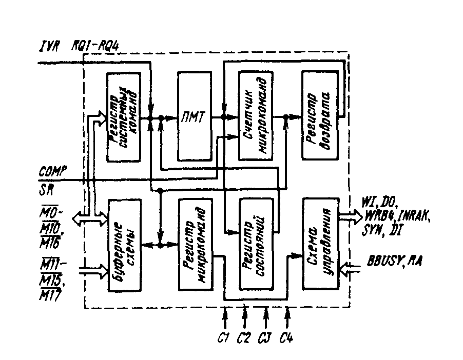

: Рис. 4.5. Структурная схема КР581ИК2

### 4.2.4 Временная диаграмма работы

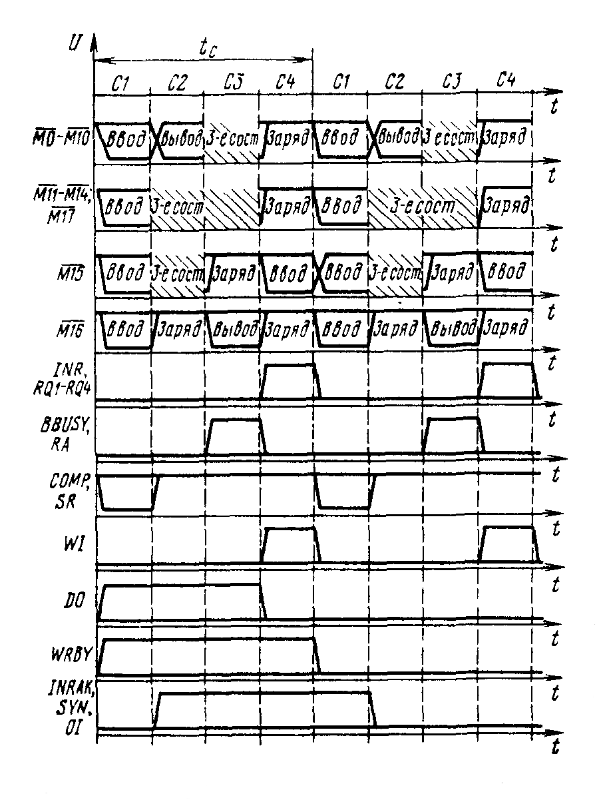

: Рис. 4.6. Временная диаграмма работы КР581ИК2

### 4.2.5 Описание работы

При генерации адресов микропоследовательностей, реализующих конкретную
системную команду, а также управляющих сигналов для внешних операций
ввода/вывода в качестве исходной информации используются 16-разрядные
системные команды и текущие микрокоманды.

Микросхема управляется 16-разрядными системными командами и 18-разрядными
микрокомандами, поступающими по ШМК.

Для установки микросхемы в режим приема микрокоманд из микропрограммного
постоянного запоминающего устройства на вход SR подается соответствующий
сигнал. При этом счетчик микрокоманд устанавливается в исходное состояние и в
этом же цикле микросхема формирует и выдает в ШМК микрокоманду «Нет
операции». В следующем тактовом цикле микросхема готова принять информацию из
ШМК.

Расшифровывая микрокоманды, микросхема выдает управляющие сигналы, отражающие
режим работы МПК. Состояние программируемой матрицы трансляции запоминается
в регистре состояний. На вход ПМТ поступают четыре сигнала прерывания. Логика
ПМТ осуществляет арбитраж приоритетов прерываний. На вход ПМТ поступает также
информация внутренних флагов состояний, которые устанавливаются и
сбрасываются в процессе выполнения микропрограммы.

Счетчик микрокоманд увеличивает свое состояние на единицу после каждого
обращения к микропрограммному постоянному запоминающему устройству, кроме
случаев, когда он загружается микрокомандами перехода или выходной
информацией ПМТ.

Выполнение одноуровневых подпрограмм обеспечивается регистром возврата,
который может хранить и восстанавливать содержимое счетчика микрокоманд.
Расшифровку системной команды микросхема производит побайтно, причем вначале
обрабатывается старший байт команды и формируется стартовый адрес
микропоследовательности, реализующей данную системную команду.

В зависимости от кода операции микрокоманды обрабатываются микросхемой за
один или два тактовых цикла. При обработке двуцикловой микрокоманды новый
адрес запрашивается из микропрограммного постоянного запоминающего устройства
в течение двух циклов.

В режим ожидания микросхема устанавливается в случае ожидания системной
информации до тех пор, пока на вход RA не поступит соответствующий уровень
управляющего сигнала. В режим ожидания микросхема устанавливается также при
занятости системного канала при соответствующем сигнале на входе «BBUSY». Из
режима ожидания микросхема выходит с приходом системной команды и сигнала
«Готово» на вход RA.

### 4.2.6 Статические параметры

Статические параметры КР581ИК1 приведены в табл. 4.8.

: Таблица 4.8

| Параметр                                                      | Обозначение      | мин. | макс. | Примечание              |
| ------------------------------------------------------------- | ---------------- | ---- | ----- | ----------------------- |
| Ток потребления от источника U<sub>CC1</sub>, мА              | I<sub>CC1</sub>  | —    | 8.0*  | T = +25°C               |
| Ток потребления от источника U<sub>CC2</sub>, мА              | I<sub>CC2</sub>  | —    | 25.0* | T = +25°C               |
| Ток потребления от источника U<sub>CC3</sub>, мА              | I<sub>CC3</sub>  | —    | 1.0*  | T = +25°C               |
| Выходное напряжение высокого уровня ШМК, В                    | U<sub>OHM</sub>  | 3.4  | —     |                         |
| Выходное напряжение низкого уровня ШМК, В                     | U<sub>OLM</sub>  | —    | 0.5   |                         |
| Выходное напряжение высокого уровня по управляющим выходам, В | U<sub>OH</sub>   | 2.3  | —     | I<sub>OH</sub> = 0.2 мА |
| Выходное напряжение низкого уровня по управляющим выходам, В  | U<sub>OL</sub>   | —    | 0.6   | I<sub>OL</sub> = 1.6 мА |
| Входное напряжение высокого уровня по ШМК, В                  | U<sub>IHM</sub>  | 3.4  | —     |                         |
| Входное напряжение низкого уровня по ШМК, В                   | U<sub>ILM</sub>  | —    | 0.7   |                         |
| Входное напряжение низкого уровня по управляющим выходам, В   | U<sub>IL</sub>   | —    | 0.7   |                         |
| Емкость входов, пФ                                            | C<sub>IC</sub>   | —    | 10    | T = +25°C               |

## 4.3 Микросхемы КР581РУ1, КР581РУ2 и КР581РУЗ

Микросхемы микропрограммного постоянного запоминающего устройства (МПЗУ)
КР581РУ1, КР581РУ2 и КР581РУЗ предназначены для хранения и оперативной выдачи
микропрограмм для реализации основного набора команд микропроцессора и
операций с плавающей запятой.

Условное графическое обозначение микросхем приведено Ha рис. 4.7, структурная
схема показана на рис. 4.8, назначение выводов дано в табл. 4.9, временная
диаграмма работы приведена на рис. 4.9,

### 4.3.1 Условное графическое обозначение

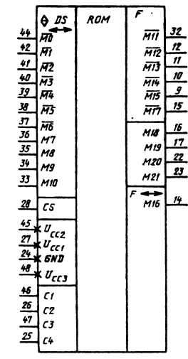

: Рис. 4.7. Условное графическое обозначение КР581РУ1, КР581РУ2, КР581РУ3

### 4.3.2 Функциональное назначение выводов

: Таблица 4.7

| Вывод          | Обозначение     | Тип вывода | Функциональное назначение выводов |
| -------------- | --------------- | ---------- | --------------------------------- |
| 33..42, 44     | !M10..!M0       | Вход/выход | Разряды 10..0 шины микрокоманд. Обмен микрокомандами и адресами |
| 9..12, 32      | !M15..!M11      | Выход      | Разряды 15..11 шины микрокоманд   |
| 14             | !M16            | Вход/выход | Разряд 16 шины микрокоманд. Информация о числе циклов |
| 15             | !M17            | Выход      | Разряд 17 шины микрокоманд        |
| 23..22, 17..16 | !M21..!M18      | Выход      | Разряды 21..18 шины микрокоманд   |
| 46, 26, 47, 25 | C1 — C4         | Входы      | Тактовые сигналы от внешнего генератора |
| 27             | U<sub>CC1</sub> | —          | Напряжение питания +5 B           |
| 45             | U<sub>CC2</sub> | —          | Напряжение питания +12 B          |
| 48             | U<sub>CC3</sub> | —          | Напряжение питания -5 B           |
| 24             | GND             | —          | Общий                             |

### 4.3.3 Структурная схема

Функционально каждая микросхема содержит:

* схему выбора конкретной микросхемы;
* дешифратор;
* матрицу ПЗУ микропрограмм.

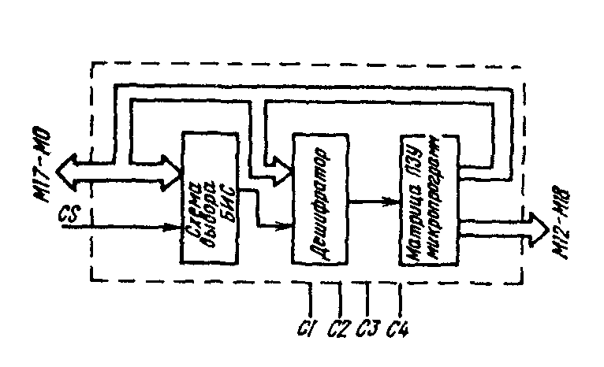

: Рис. 4.8. Структурная схема КР581РУ1, КР581РУ2, КР581РУЗ

Микросхемы КР581РУ1 и КР581РУ2 обеспечивают реализацию основного набора
команд микропроцессора, а КР581РУ3 — реализацию операций с плавающей запятой.

Емкость матрицы ПЗУ микропрограмм каждой микросхемы 512 бит нa 22 разряда.

Разряды 1..0 служат в качестве адресных входов дешифратора столбцов, разряды
8..2 — дешифратора строк. На разряды 10..9 поступает информация разрешения
(запрета) данного кристалла для выбора нужной микросхемы МПЗУ.

Разряды 21..11 используются только для вывода информации из МПЗУ и
используются для выполнения специальных функций системы.

### 4.3.4 Временная диаграмма работы

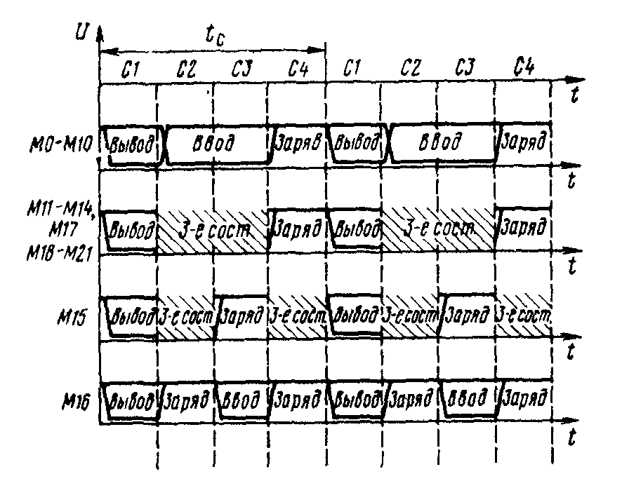

: Рис. 4.9. Временная диаграмма работы КР581РУ1, КР581РУ2, КР581РУЗ

### 4.3.5 Описание работы

Схема соединения микросхем МПК серии KP581 приведена на рис. 4.10. Базовый
МПК включает в себя микросхемы КР581ИК1, КР581ИК2, КР581РУ1 и КР581РУ2.
Полный МПК содержит дополнительно КР581РУЗ.

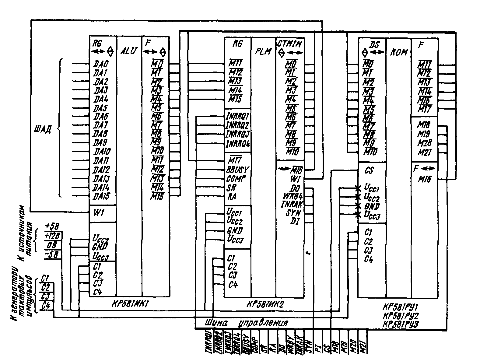

: Рис. 4.10. Схема соединения микросхем МПК серии КР581

Обмен информацией микросхем между собой и с внешними схемами осуществляется
через 16-разрядную совмещенную шину адреса и данных, шину микрокоманд и шину
управления, Команда, подлежащая исполнению, поступает на ШАД, передается на
ШМК и записывается в регистр системных команд. Начинается процесс вычисления
адреса начала последовательиости микрокоманд (микропрограммы), реализующей
данную системную команду.

Микропроцессор работает в конвейерном режиме, при котором выполнение одной
микрокоманды перекрывается во времени с вычислением адреса и выборкой
очередной микрокоманды.

Используется три типа команд: безадресные, одноадресные и двухадресные.

МПК выполняет одно- и двухадресные команды как с 16-разрядными словами, так и
с 8-разрядными байтами. Поэтому многие операции могут выполняться очень
эффективно.

Выполнение команды начинается с операции по ее выборке, для чего в шину
адреса и данных выводится адрес данной команды. После поступления команды и
ее дешифрации выполняются операции по выборке операндов с использованием
соответствующих методов адресации. Затем производится собственно операция по
исполнению данной команды. При этом в зависимости от кода команды результат
может как заноситься в соответствующий РОН, так и выводиться в шину адреса и
данных.

В безадресных командах команда содержит только код операции.

В кодах одно- и двухадресных команд обычно содержится информация, которая
определяет:

* выполняемую функцию (код операции);
* адрес регистров общего назначения, используемых при выборке операндов;
* метод адресацин (способ использоваиия выбранного РОН).

Регистры общего назначения могут быть использованы:

* как накопители (обрабатываемые данные хранятся в регистрах);
* как указатели адреса (РОН содержит адрес операнда, а не сам операнд);
* как указатели адреса, содержимое которых изменяется автоматически с
  заданным шагом, что позволяет обращаться к последовательно расположенным
  ячейкам памяти (при этом автоматическое увеличение содержимого указателя
  при обращении к последовательно расположенным ячейкам памяти носит название
  автоинкрементной, а уменьшение — автодекрементиой адресации);
* как индексные регистры, содержимое которых прибавляется к индексному слову
  для вычисления адреса операнда.

Использование автоиикрементного и автодекрементиого методов адресации дает
возможность организации стековой памяти. В качестве указателя стека может
быть выбран любой программно доступный РОН.

Общее число команд, включая команды с плавающей запятой, 72.

### 4.3.6 Статические параметры

Статические параметры микросхем КР581РУ1 — КР581РУЗ приведены в табл. 4.10.

: Таблица 4.10

| Параметр                                                      | Обозначение      | мин. | макс. | Примечание              |
| ------------------------------------------------------------- | ---------------- | ---- | ----- | ----------------------- |
| Ток потребления от источника U<sub>CC1</sub>, мА              | I<sub>CC1</sub>  | —    | 16.0* | T = +25°C               |
| Ток потребления от источника U<sub>CC2</sub>, мА              | I<sub>CC2</sub>  | —    | 10.8* | T = +25°C               |
| Ток потребления от источника U<sub>CC3</sub>, мА              | I<sub>CC3</sub>  | —    | 1.0*  | T = +25°C               |
| Выходное напряжение высокого уровня ШМК (M17..M0), В          | U<sub>OHM</sub>  | 3.4  | —     |                         |
| Выходное напряжение низкого уровня ШМК (M17..M0), В           | U<sub>OLM</sub>  | —    | 0.5   |                         |
| Выходное напряжение высокого уровня ШМК (M21..M18), В         | U<sub>OHM</sub>  | 2.3  | —     | I<sub>OH</sub> = 0.2 мА |
| Выходное напряжение низкого уровня ШМК (M21..M18), В          | U<sub>OLM</sub>  | —    | 0.4   | I<sub>OL</sub> = 1.6 мА |
| Входное напряжение высокого уровня по ШМК, В                  | U<sub>IHM</sub>  | 3.4  | —     |                         |
| Входное напряжение низкого уровня по ШМК, В                   | U<sub>ILM</sub>  | —    | 0.7   |                         |
| Входное напряжение высокого уровня по входу CS, В             | U<sub>IHCS</sub> | 3.4  | —     |                         |
| Входное напряжение низкого уровня по входу CS, В              | U<sub>ILCS</sub> | —    | 0.7   |                         |
| Емкость входов, пФ                                            | C<sub>IC</sub>   | —    | 8     |                         |

## 4.4 Микросхема KP581BE1

Микросхема KP581BE1 представляет coбой микропроцессор с микропрограммным
управлением, в функциональном отношении аналогичный базовому МПК серии КР581,
состоящему из микросхем КР581ИК1, КР581ИК2, КР581РУ1, КР581РУ2. Она
обеспечивает реализацию системы команд базового МПК (типа «Электроника-60»).

Микросхема изготовляется по высокоточнной n-канальной МДП-технологии с
поликремниевыми затворами.

Область применения:

* управление производством и технологическими процессами;
* сбор и обработка данных;
* решение научно-технических и экономико-статистических задач;
* проведение инженерно-конструкторских расчетов;
* моделирование и управление объектами в реальном масштабе времени.

Условное графическое обозначеиие КР581ВЕ1 приведено на рис. 4.11, структурная
схема дана на рис. 4.12, функциональное назначение выводов показано в табл.
4.11, временная диаграмма входных и выходных сигналов — на рис. 4.13.

: Общие характеристики КР581ВЕ1

```
Разрядность обрабатываемых данных ............................ 8, 16 бит
Управление ................................................... Микропрограммное
Число типов команд ........................................... 64
Объем адресуемой памяти ...................................... 64К байт
Число способов адресации ..................................... 8
Число уровней прерывания ..................................... 4
Шина адреса и данных ......................................... Совмещеиная
Быстродействие ............................................... 330 тыс. операций/с
Система команд ............................................... Типа «Электроника-60»
```

### 4.4.1 Условное графическое обозначение

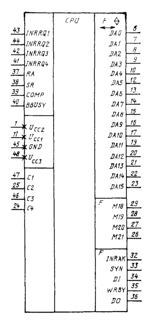

: Рис. 4.11. Условное графическое обозначение КР581ВЕ1

### 4.4.2 Функциональное назначение выводов

: Таблица 4.11

| Вывод                 | Обозначение     | Тип вывода | Функциональное назначение выводов |
| --------------------- | --------------- | ---------- | --------------------------------- |
| 23..19, 17..12, 10..6 | DA15..DA0       | Вход/выход | Шнна адреса и данных. Используется мультиплексный режим работы информационных шин, адресные сигиалы, команды и данные передаются по одной шине |
| 26..29                | M21..M18        | Выходы     | Разряды 21..18 микрокоманды       |
| 43                    | INRRQ1          | Вход       | Требование прерывания от внешиего устройства |
| 44                    | INRRQ2          | Вход       | Требование прерывания по таймеру |
| 42                    | INRRQ3          | Вход       | Требование прерывания по питанию |
| 41                    | INRRQ4          | Вход       | Требование прерывания по регенерации ОЗУ |
| 37                    | RA              | Вход       | Сигнал «Готово». Подается в случае, когда данные установлены в канале или приняты |
| 38                    | SR              | Вход       | Сигнал «Сброс». Начальная установка адреса |
| 39                    | COMP            | Вход       | Сигнал «Отладка». Используется при технологической отладке |
| 40                    | BBUSY           | Вход       | Сигнал «Канал занят». Подается в случае занятости канала. Микропроцессор переходит в режим ожидания |
| 32                    | INRAK           | Выход      | Сигнал «Подтверждение прерывания». Означает, что требование прерывания принято |
| 33                    | SYN             | Выход      | Сиихросигиал. Формируется при установке адреса в канале и сохраняется до конца цикла обращения к каналу |
| 34                    | DI              | Выход      | Сигнал «Ввод — данных». Формируется при операциях ввода данных |
| 35                    | WRBY            | Выход      | Сигиал «Запись байта». Формируется при операциях вывода адреса или при выводе байта |
| 36                    | DO              | Выход      | Сигнал «Вывод данных». Формируется при операциях вывода данных |
| 11                    | U<sub>CC1</sub> | —          | Напряжение питания +5 B           |
| 1                     | U<sub>CC2</sub> | —          | Напряжение питания +12 B          |
| 48                    | U<sub>CC3</sub> | —          | Напряжение питания -5 B           |
| 45                    | GND             | —          | Общий                             |

### 4.4.3 Структурная схема

Условно в структурной схеме можно выделить три основных функциональных блока:

* обработки информации, включающий в себя арифметико-логическое устройство,
  блок регистров общего назначения, дешифратор для адресации к РОН и схемы
  управления АЛУ;

* управления выполнением операций, включающий в себя контроллер
  микропрограммной последовательности (КМП), регистры команд и микрокоманд,
  логику управления вводом и выводом ииформации и обработки прерываний;

* микропрограммное постоянное запоминающее устройство (МПЗУ).

Обмен информацией между основными блоками микропроцессора осуществляется по
внутренней шине микрокоманд.

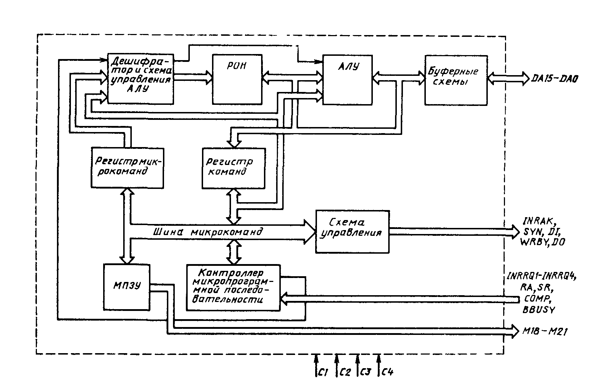

: Рис. 4.12. Структурная схема КР581ВЕ1

### 4.4.4 Временная диаграмма работы

На временной диаграмме (рис. 4.13) приняты следующие обозначения:

* Данные установлены — на шинах DA15..DA0 установлены истинные данные;

* Ввод данных — в данный промежуток времени осуществляется ввод данных в
  микропроцессор;

* Вывод данных — вывод данных из микропроцессора;

* Ввод — на данном входе БИС или группе входов в обозначенном промежутке
  времени происходит прием соответствующей информации;

* Вывод информации — на данном выходе или группе выходов в обозначенный
  промежуток времени осуществляется вывод информации;

* Заряд — на данной группе выходов в обозначенный промежуток времени
  осуществляется заряд шин до высокого уровня напряжения.

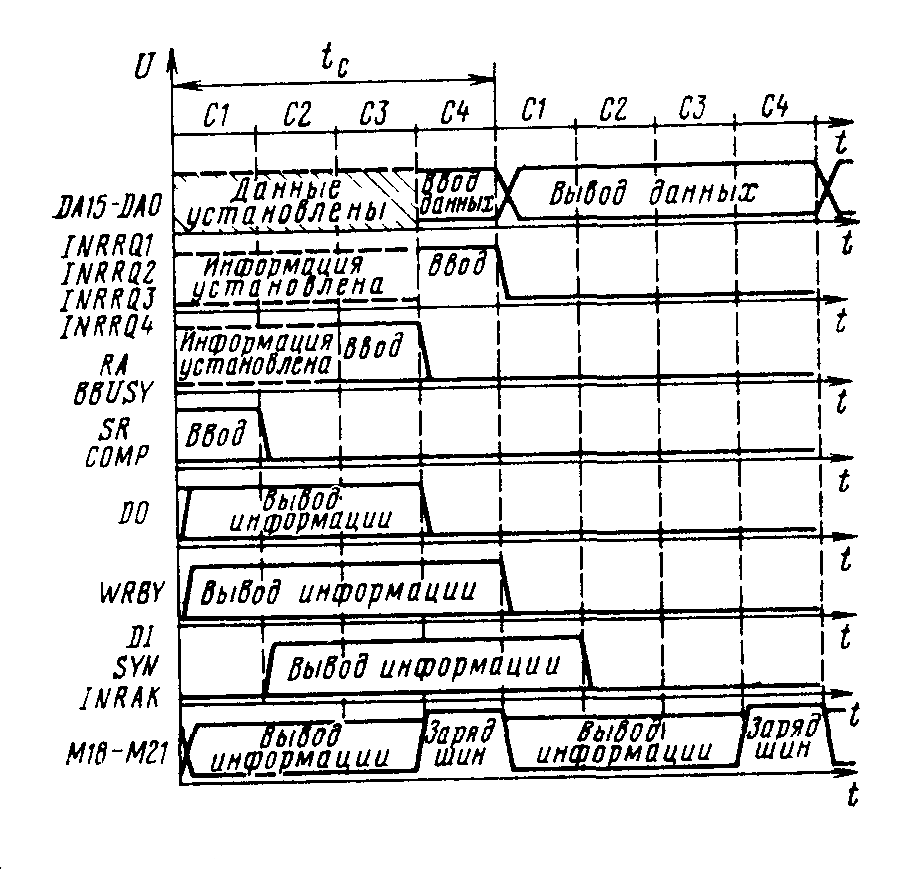

: Рис. 4.13. Временная диаграмма работы КР581ВЕ1

### 4.4.5 Описание работы

Работа микропроцессора происходит следующим образом. Команда, подлежащая
исполнению, поступает на совмещениую шину адреса и данных (DA15..DA0 на
структурной схеме), заносится в регистр команд и поступает во внутреннюю шину
микрокоманд. Начинается процесс вычисления адреса начала последовательности
микрокоманд (микропрограммы), реализующей данную системную команду. Принятая
команда по ШМК поступает далее на расшифровку нa входы контроллера
микропрограммной последовательности.

Выходная информация КМП является функцией предыдущей микрокоманды, системной
команды, слова состояния и управляющей информации. Вычисленный адрес по ШМК
поступает на входы ПЗУ микропрограмм (МПЗУ), которое формирует
соответствующую данному адресу микрокоманду. Ёмкость матрицы МПЗУ — 1К
22-разрядных микрокоманд.

Младшие 18 разрядов микрокоманды направляются в ШМК для ее исполнения,
старшие 4 разряда поступают в шину управления для управления внешними
устройствами (M21..M18).

Разряды 15..0 микрокоманды поступают в регистр микрокоманд, где хранятся весь
период ее выполнения. С выхода регистра микрокоманд микрокоманда поступает
снова на вход КМП для участия в вычислении адреса следующей микрокоманды.
Адресная часть микрокоманды поступает нa входы дешифратора для дешифрации
содержимого блока регистров общего назначения, а код операции микрокоманды
подается для расшифровки на логику управления АЛУ, которая вырабатывает
сигналы, управляющие режимом работы АЛУ. Информация с выхода дешифратора
поступает на адресные входы блока РОН. Выбранные из блока регистров общего
назначения данные поступают на обработку в АЛУ, которое параллельно
обрабатывает два операнда.

В качестве одного из операндов может использоваться литеральная часть
микрокоманды.

Результат обработки информации АЛУ записывается в блок регистров общего
назначения по адресу, определенному разрядами 3..0 микрокоманды. При операциях
ввода информация, поступающая по ШАД, записывается в блок регистров общего
назначения, а при операциях вывода выводится в ШАД.

Блок РОН состоит из 26 8-разрядных регистров:

* 10 регистров могут прямо адресоваться микрокомандами;
* 4 адресуются прямо и косвенно (косвенная адресация осуществляется в
  соответствии с адресными полями системной команды, хранящейся в регистре
  команд) — эти регистры, как правило, содержат операнды источника и
  назначения, информацию о текущем состоянии, а также выполняют специальные
  функции центрального процессора, например счетчик команд, указатель стека;
* 12 регистров имеют только косвенную адресацию и используются в качестве
  регистров общего назначения при выполнении команд.

Микропроцессор на микрокомандном уровне работает в конвейерном режиме, при
котором выполнение одной микрокоманды совмещается во времени с вычислением
адреса и выборкой очередной микрокоманды. Выполнение операций над байтами
осуществляется за один микрокомандный цикл.

В случае, если происходит операция над полным словом (16 разрядов), то она
завершается за два цикла под управлением одной двухцикловой микрокоманды.

Система микрокоманд микросхемы KP581BE1 полностью совпадает с системой
микрокоманд МПК серии КР581.

Для управления работой микросхемы используется серия из четырех тактовых
сигналов C1..C4. Под микрокомандным циклом t<sub>C</sub> понимается период
следования любого из тактовых сигналов. В случае, когда нет режима ввода или
вывода информации, шины DA15..DA0 устанавливаются в 3-е (высокоомное)
состояние.

### 4.4.6 Статические параметры

Статические параметры KP581BE1 приведены в табл. 4.12.

: Таблица 4.12

| Параметр                                                      | Обозначение      | мин. | макс. | Примечание               |
| ------------------------------------------------------------- | ---------------- | ---- | ----- | ------------------------ |
| Ток потребления от источника U<sub>CC1</sub>, мА              | I<sub>CC1</sub>  | —    | 8*    | T = +25°C                |
| Ток потребления от источника U<sub>CC2</sub>, мА              | I<sub>CC2</sub>  | —    | 36*   | T = +25°C                |
| Ток потребления от источника U<sub>CC3</sub>, мА              | I<sub>CC3</sub>  | —    | 0.8*  | T = +25°C                |
| Входное напряжение высокого уровня по тактовым входам, В      | U<sub>IHC</sub>  | 11,4 | 12,6  |                          |
| Входное напряжение низкого уровня по тактовым входам, В       | U<sub>ILC</sub>  | -0,5 | 0,5   |                          |
| Входное напряжение высокого уровня, В                         | U<sub>IH</sub>   | 3.4  | 5.25  |                          |
| Входное напряжение низкого уровня, В                          | U<sub>IL</sub>   | -0.5 | 0.7   |                          |
| Выходное напряжение высокого уровня, В                        | U<sub>OH</sub>   | 2.3  | —     | I<sub>OH</sub> = -80 мкА |
| Выходное напряжение низкого уровня, В                         | U<sub>OL</sub>   | —    | 0.6   | I<sub>OL</sub> = 0.8 мА  |
| Емкость входов, пФ                                            | C<sub>IC</sub>   | —    | 15    | T = +25°C                |

